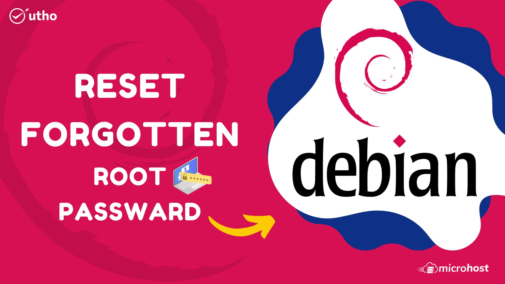
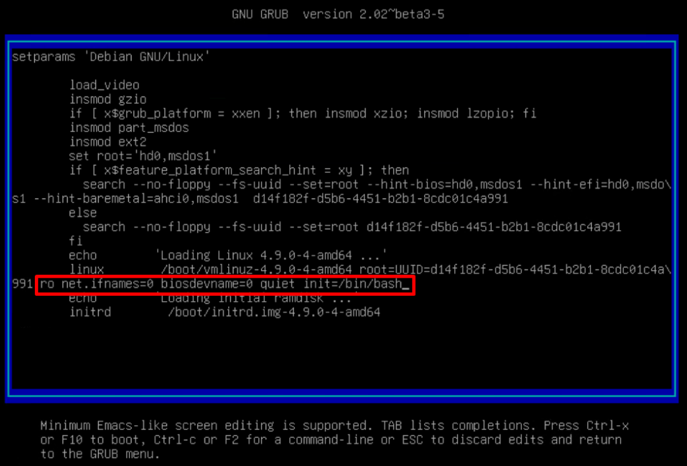

In this tutorial, we will learn how to reset a forgotten root password in a **Debian** system. 

So, first power on or reboot **Debian** system. It should be presented with a **GRUB** menu as shown below. On the first option, proceed and press the `‘e’` key on the keyboard before the system starts booting .


Scroll down and locate the line that begins with `‘linux’` that precedes the `/boot/vmlinuz-*` section that also specifies the **UUID**.


Move the cursor to the end of this line, just after `‘ro net.ifnames=0 biosdevname=0 quiet’` and append the parameter `init=/bin/bash`.



Next hit `ctrl + x` to enable it to boot in single-user mode with the root filesystem mounted with read-only `(ro)` access rights.

To reset the password, we need to change the access right from **read-only** to **read-write**. Therefore, run the command below to remount the root filesystem with `rw` attributes.

```
mount -n -o remount,rw /
```


Next, reset the root password by executing the good old **passwd** command as shown.

```
passwd
```


With the root password successfully changed, **reboot** your **Debian** system by Ctrl + Alt + Del .

And that’s how reset a forgotten root password on **Debian**.

Thankyou.
