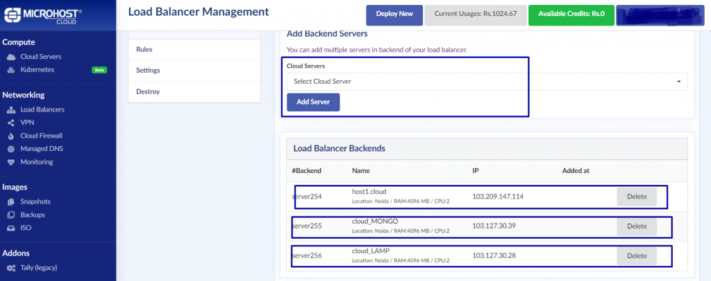

---


**Introduction**: In this article, we are going to setup a testing environment to test the load distribution using loadbalancer among applications running on custom ports rather then port 80. In this testing , we are using 3 different servers installed and configured apache on 3 different ports.

**Step 1**: Firstly, we need to make 3 different servers ready with apache running on respective ports (8080, 8081, 8082) . You can refer "apache port change" article for more details on apache installation on custom port. 


**Step 2**: We need to create a load balancer to check the traffic distribution among these above three servers. Please have a look on the below screenshot for your reference.


**Step 3**: Once the loadbalacer would be successfully completed, we need to add our backend servers in it to distribute the traffic of all three servers. For managing the loadbalancer we need to click on action button and then click on manage load  balancer option as per the below screenshot.


**Step 4** : Now we have to add the servers in the loadbalancer.



**Step 5** : Once the servers will be added then we need to modify the loadbalancer configuration file, as it takes by default traffic distribution on port 80. Hence we need to change the port to our respective ports that are 8080, 8081,8082. The path of configuration file is /etc/haproxy/haproxy.cfg. Please have a look on the highlighted part of screenshot for more details.


**Step 6** : Once the modification will be done in the haproxy  conf file then you need to save the file and restart the haproxy service using below command

```
# **systemctl restart haproxy** 
```

**Step 7**: Now we can verify the testing while accessing the lodbalancer ip in browser.


Thank you :)
