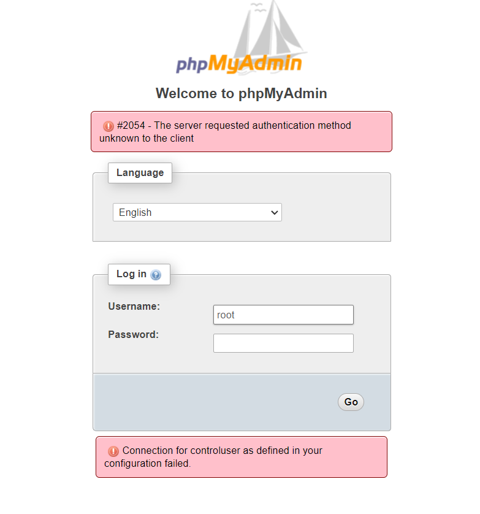

## INTRODUCTION

In this tutorial, we will learn how to solve "The server requested authentication method unknown to the client" in [phpMyAdmin](https://utho.com/docs/tutorial/how-to-install-phpmyadmin-on-centos/).



### The forementioned error is faced when connection for control user as defined in the configuration fails.

### We use the following steps the resolve the error. requested authentication method unknown

Step 1. Run the following command

```
mysql -u root -p
```

Step 2. Then run the below command to change the user’s authentication plugin type;

```
ALTER USER 'root'@'localhost' IDENTIFIED WITH mysql_native_password BY 'password';
```

Step 3. change the MySQL authenticat**e** method in the mysql config file

```
vi /etc/mysql/mysql.conf.d/mysqld.cnf
```

**```
[mysqld]
```**

```
default_authentication_plugin=mysql_native_password
```

requested authenticate method not known

Step 4. **Then run the below command in the [MySQL](https://www.mysql.com/) prompt.**

```
mysql -u root -p
```

```
mysql > flush privileges;
```

Step 5. Now restart the MySQL service in the server.

```
service mysql restart
```

**Thank You**!
