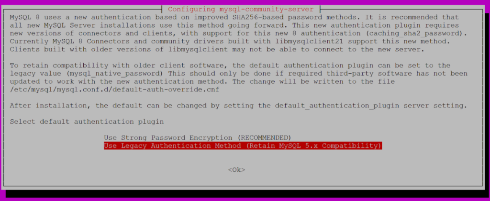

We will complete this task in two phases. upgrade mysql 5.7 to 8.0 in Ubuntu 16.04

#### PHASE 1 - Uninstalling mysql 5.7

#### PHASE 2 - Installing mysql 8.0

\--------------------------------------------------------------------------------------------------------------

Firstly, backup your databases from phpmyadmin if you have phpmyadmin installed on your server. OR, take backup of the databases using mysqldump.

[Import and Export Databases in MySQL](https://utho.com/docs/tutorial/how-to-import-and-export-databases-in-mysql-or-mariadb/) using mysqldump

\--------------------------------------------------------------------------------------------------------------

Let's begin with phase 1 - uninstalling mysql 5.7

Step 1. Log into your linux server via ssh and stop mysql services

```
systemctl stop mysql
```

Step 2. Now run the following command to uninstall MySQL package

upgrade mysql 5.7 to 8.0 in Ubuntu 16.04

```
sudo apt-get remove dbconfig-mysql
```

Step 3. Now remove the all files related to MySQL

```
sudo apt-get remove --purge mysql*
```

Step 4. It asks to remove data directories, if you want to remove , Enter on **Yes** button.


Step 5. Next it asks to remove all MySQL databases, if you want to remove, Enter on **Yes** button.


Step 6. To remove undependent packages run the following command

```
sudo apt-get autoremove
```

Step 7. To clean local apt  pacakges run the following command

```
sudo apt-get autoclean
```

We have now installed mysql 5.7 from ubuntu 16.04.

\--------------------------------------------------------------------------------------------------------------

Now let's start with phase 2 - installing mysql 8.0

Step 1. Install the MySQL/Oracle Apt repository first

```
wget https://dev.mysql.com/get/mysql-apt-config_0.8.14-1_all.deb
```

```
dpkg -i mysql-apt-config_0.8.10-1_all.deb
```

The MySQL APT repository installation package allows you to pick what MySQL version you want to install, as well as if you want access to Preview Versions.


Step 2. Update repository configuration and install MySQL Server

```
apt-get update
```

```
apt-get install mysql-server
```

The installation process asks you to set a password for the root user:


Step 3. Next, the installation script asks you whether to use Strong Password Encryption or Legacy Authentication:



While using strong password, it is recommend for security purposes, not all applications and drivers support this new authentication method. Going with Legacy Authentication is a safer choice

**All Done** upgrade mysql 5.7 to 8.0 in Ubuntu 16.04

Step 4. You should have MySQL 8.0 Server running. You can test it by connecting to it with a command line client:


MySQL upgraded on Ubuntu 16.04 LTS

Thank You!

[](https://www.percona.com/blog/wp-content/uploads/2018/05/Installing-MySQL-8.0-on-Ubuntu-3.png)
