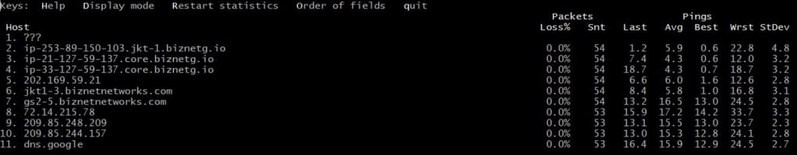

## Introduction

In this article, you will learn how to use MTR command in Linux.

My Traceroute, also known as MTR, is a tool that evaluates the state of a network connection through the use of the traceroute and ping commands.

My traceroute is a computer programme that was initially known as Matt's traceroute. It is a network diagnostic utility that combines the capabilities of the traceroute and ping computer programmes into a single application.

[MTR](https://en.wikipedia.org/wiki/MTR_(software)) examines routers along the route path by putting a cap on the number of hops that individual packets are allowed to take and then listening for responses about when those packets expire.

## Install MTR on Linux

With the following command, you will install MTR on different operating systems.

##### MTR on Debian/Ubuntu

```
# apt-get install mtr

```

##### MTR on Fedora/CentOS

```
# yum install mtr

```

##### MTR on Arch/Manjaro

```
# pacman -S mtr

```

##### MTR on BSD

```
# pkg install mtr

```

## Use of MTR

##### Installing MTR on your web server and running it against your local machine will help you gain a deeper comprehension of the performance problems that are affecting your network.

**MTR can be used to perform real-time scans as well as scans in a summary format.**

**Execute mtr with a domain, server IP, or server hostname, and you will be able to view real-time performance statistics.**

```
# mtr domain.com

```

```
# mtr Server\_IP

```



**During the scan, you will have the following options that are available to you:**

- **Help – Display open command options for the current MTR testing**
- **D**isplay mode – Change how data on packets and pings are shown
- **R**estart statistics – Start the test over again
- **O**rder of fields – Change the order of the columns that are open (press Enter to leave)
- **q**uit – Stop MTR

**You can always copy the results. We suggest that you wait until you have sent at least 50 packages to get an accurate estimate.**

```
# mtr -rw yourdomain.com -c 100

```

- `-c` or `--report-cycles` – Set how many pings are sent to each hope to test its stability. (each cycle lasts one second)
- `-r` or `--report` – Run the test in the background, and when it's done, print out the results.
- `-w` or `--report-wide` – Make sure that the results list full hostnames instead of???

If you do not specify a number with the -c option, MTR will stop functioning after it has sent 10 packets.

**To put MTR outcomes into a CSV file, do the following:**

```
# mtr -rwC yourdomain.com -c 100 > mtr-results.csv

```

Output options:

- `-l` or `--raw`
- `-C` or `--csv` (separator is a semi-colon “;”)
- `-j` or `--json`
- `-x` or `--xml`

## Conclusion

Hopefully, you have learned how to use MTR command in Linux.

**Also Read:** [How to Use Iperf to Test Network Performance](https://utho.com/docs/tutorial/how-to-use-iperf-to-test-network-performance/)

Thank You 🙂
