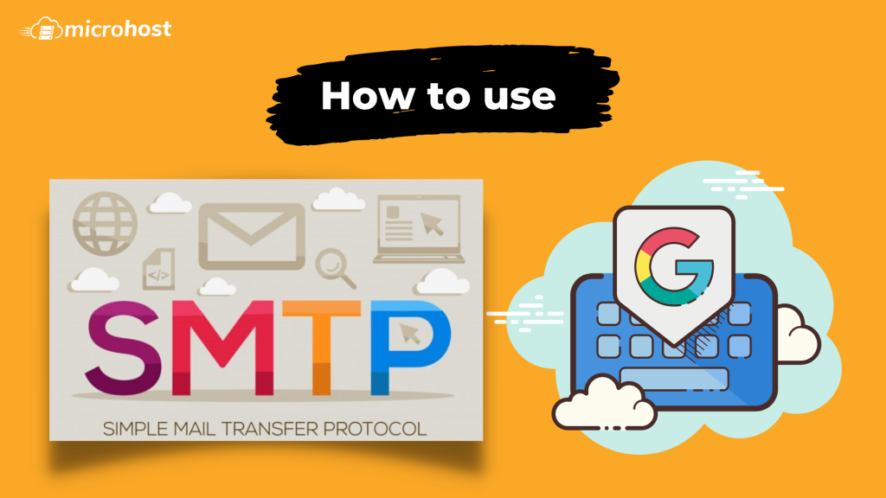

## Introduction

A little-known feature of Gmail and Google Apps email is Google’s portable SMTP server. You can configure Google’s SMTP server settings with whatever script or program you wish to send email. All you need is either (i) a free Gmail account, or (ii) a paid G Suite account.

## Benefits

You can choose to have Google store and index the emails you send through its SMTP server. This will make all of your sent emails searchable and safe on Google's servers. If you choose to use Gmail or G Suite for both outgoing and incoming email, all of your email will be in one place. Also, because Google's [SMTP](https://en.wikipedia.org/wiki/Simple_Mail_Transfer_Protocol) server doesn't use port 25, an ISP is less likely to block or mark your email as spam.

## Settings

Google’s SMTP server requires authentication, so here’s how to set it up in your mail client or application

1. SMTP server (i.e., outgoing mail server): **\[[smtp.gmail.com](http://smtp.gmail.com/) ([http://smtp.gmail.com](http://smtp.gmail.com/))**
2. SMTP username: **Your full Gmail or G Suite email address** (e.g., `example@gmail.com` or `example@your_domain`)
3. MTP password: Your Gmail or G Suite email password
4. SMTP port: 465
5. SMTP **TLS/SSL required**: **yes**

Before you begin, consider investigating your mail client or application’s security rating, according to Google. If you are using a program that Google does not consider secure, your usage will be blocked unless you generate an application-specific App Password.

You must also make sure that IMAP access is turned on for your account so that Google can automatically move your sent emails to the sent folder.

To do so, go to the Gmail settings and click on the **Forwarding and POP/IMAP** tab. Scroll down to the **IMAP Access** section and make sure that IMAP access is enabled for your account.

## Sending Limits

Users can only send a certain amount of mail through Google's portable SMTP server. With this limit, you can only send 99 emails per day. The limit is lifted automatically 24 hours after you send all 99 emails.

**Must Read :** [How to configure an external SMTP server in Plesk](https://utho.com/docs/tutorial/how-to-configure-an-external-smtp-server-in-plesk/)
