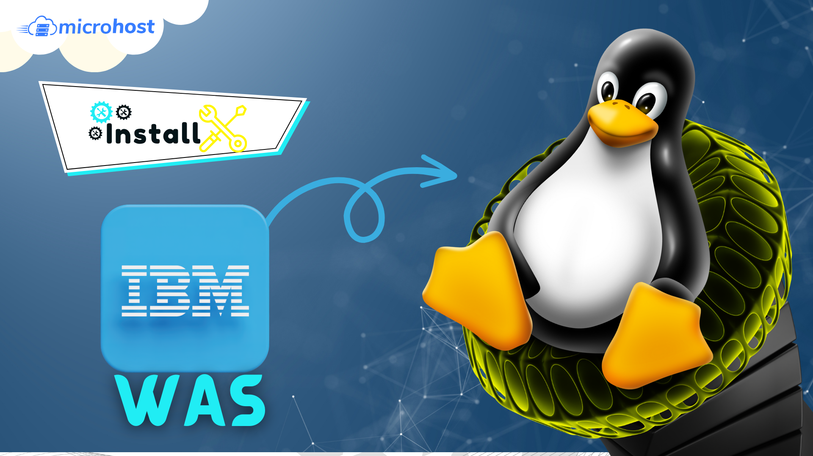

<figure>



<figcaption>

How to install IBM WAS in linux

</figcaption>

</figure>

In this tutorial, you will learn how to install IBM Websphere Application Server in linux. WebSphere Application Server is the most popular JEE application platform in the world. Tens of thousands of businesses use it to run more than a million applications.

## Prerequisites

1. Need to have IBM id to install IBM WAS
2. Super User or any normal user with SUDO privileges.
3. IBM Installation Manager installed machine. You can **install IBM installation manager** using [this guide](https://utho.com/docs/tutorial/how-to-install-ibm-installation-manager/).

## Steps to install IBM

Step 1. Installation of Installation manager, creates a new directory in /opt named as IBM. Now go to this directory and list all available files

```
cd /opt/IBM/InstallationManager/eclipse/tools/
```
Step 2. Now find and save or copy either the latest [online BASE repository](https://www.ibm.com/software/repositorymanager/com.ibm.websphere.BASE.v90) or the [composite repository](https://www.ibm.com/software/repositorymanager/V9WASBase) to install WAS. At this time, following are the above mentioned repositories and [**THIS**](https://www.ibm.com/docs/en/was/9.0.5?topic=installation-online-product-repositories-websphere-application-server-offerings) is the URL to find these repositories. In this tutorial we will use composite repositories to install IBM WAS.

<figure>


<figcaption>

Repositories to install IBM WAS

</figcaption>

</figure>

Step 3. List all the available packages in the given repository. As mentioned, we will use the composite repository. And at the time of writing this tutorial, https://www.ibm.com/software/repositorymanager/V9WASBase is the composite repository.

```
./imcl listAvailablePackages -repositories https://www.ibm.com/software/repositorymanager/V9WASBase -prompt
```
Note that, here you will be asked to enter the IBM login credentials, such as email id and password. To enter the same, press ‘P’ then ‘email-id’ and then password

<figure>


<figcaption>

Lists of available packages in repo

</figcaption>

</figure>

If you are using composite repositories, you will see java jdk, java websphere appClient, websphere base, websphere IHS etc.

Step 4. Now install the IBM WAS of latest version and its corresponding Java version using the below command

```
./imcl install com.ibm.websphere.BASE.v90_9.0.0.20160526_1854  com.ibm.java.jdk.v8_8.0.7016.20220915_1446 -repositories https://www.ibm.com/software/repositorymanager/V9WASBase -prompt -showProgress -acceptLicense
```
<figure>


<figcaption>

Installation prompt to enter IBM login details

</figcaption>

</figure>

And this is how you have learnt how to install IBM Websphere Application Server, WAS, successfully in linux using command line.

Other useful article: [Install IBM HTTP server in Linux](https://utho.com/docs/tutorial/how-to-install-ibm-http-server-in-linux/) or [How to access IBM WAS admin console](https://utho.com/docs/tutorial/how-to-access-ibm-was-admin-console/)
