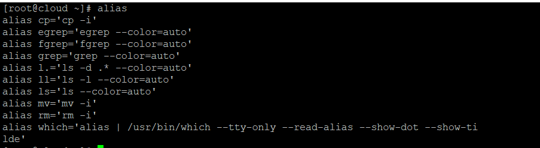
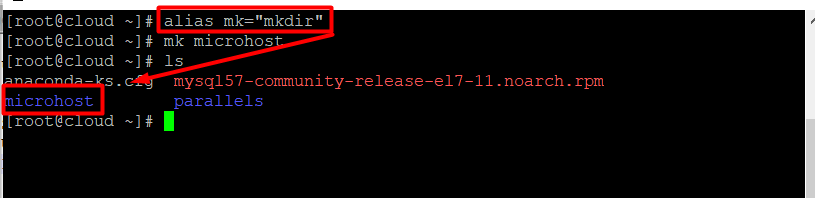

**Description**

Users of Linux often need to use the same command over and over again. Your productivity will suffer, and you will get distracted from the task at hand if you continue to type or duplicate the same instruction many times.

By generating aliases for the commands you use the most, you can save yourself a little bit of time. Aliases are similar to user-defined shortcuts in that they are used to represent a command (or group of commands) that may be carried out with or without the usage of user-defined parameters. On your Linux system, it is likely that you are already making use of aliases.

\*By running the alias command, you can see a list of the aliases you've set up on your profile.

```
#alias
```

Here you can see the aliases that Centos 7.3 has already set up for your user.



## How to Make an Alias

\*Aliases are easy to set up and don't take long. There are two kinds of aliases: ones that are temporary and ones that are permanent. We will talk about both.

## Creating Temporary Aliases

In order to alias a command, you must first write the term "alias," then use the name you want to use to execute the command, followed by the equals sign (=), and then quote the command you want to alias.

Follow the below syntex

alias shortName="your custom command here"



**Note**:If you start a new terminal session, you won't be able to use the alias. You will need a permanent alias if you want your aliases to be saved between sessions.

## Creating Permanent Aliases

You may save aliases in your user's shell configuration profile file to maintain them across sessions. It might be:

- Bash – **~/.bashrc**
- ZSH – **~/.zshrc**
- Fish – **~/.config/fish/config.fish**

You should use a syntax that is almost the same as making a temporary alias. The only thing that will be different this time is that you will save it in a file. So, for example, you can use your favourite editor to open a.bashrc file in bash:

```
#vi .bashrc
```

Determine where in the file you wish to store the aliases that you have created. One possible location for their addition is at the very end of the file. You are able to include a note before your aliases for organisational reasons, and it should look something like this:


Please save the file. The file will be loaded immediately into your next session automatically. You will need to execute the following command in order to utilise the newly created alias in this session:

```
#source .bashrc
```

To delete an alias that was added through the command line, the unalias command may be used to remove the alias.

```
#unalias alias_name
```

If you want remove all aliases.

```
#unalias -a 
```

This is a quick example of how to establish an alias for commonly used commands. Now you may build shell shortcuts for your most-used commands.

**Thank You**
