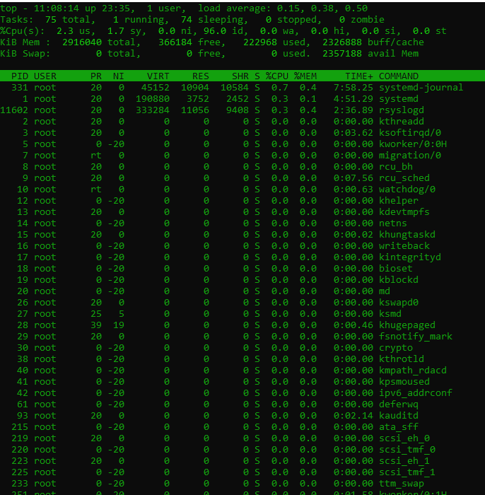

## Top Command

Linux processes are displayed by top command. It gives the running system a dynamic real-time view. In general, the system summary information and the list of processes and threads currently managed by the Linux kernel are displayed by this command.

Once the command is executed, an interactive command mode will open, where the top half of the command will include process statistics and resource use. And in the lower half, there is a list of the processes underway. Press q just leaves the command mode.



```

Row 1: top - 16:42:25 up 13 days, 14:41,  1 user,  load average: 0.09, 0.08, 0.05

Row 2 : Tasks:  65 total,   1 running,  64 sleeping,   0 stopped,   0 zombie

Row 3:  %Cpu(s):  0.0 us,  0.0 sy,  0.0 ni, 87.5 id, 12.5 wa,  0.0 hi,  0.0 si,  0.0 st

Row 4: KiB Mem :  2914368 total,  1965052 free,    81880 used,   867436 buff/cache

Row 5:  PID  USER      PR  NI    VIRT    RES    SHR  S  %CPU %MEM     TIME+  COMMAND
         9  root      20   0       0      0      0  S   0.3  0.0   21:55.05   rcu_sched
```

## First Row

```
 top - 16:42:25 up 13 days, 14:41, 1 user, load average: 0.09, 0.08, 0.05 
```

**top** : Command Name  
**16:42:25** : Current system time  
**up 13 days ,** **14:41** : System up time  
**1 user** : Total logged users  
**load average : 0.09, 0.08, 0.05** : Cpu load average in 1 min, 5 min, 15 min respectively.

## Second Row

```
 Tasks: 65 total, 1 running, 64 sleeping, 0 stopped, 0 zombie 
```

**Tasks : 65 total** : Total process in active mode  
**1 running** : Current running process  
**64 sleeping** : Total process in sleep mode  
**0 stopped** : Total process in stopped mode  
**0 zombie** : Total process in zombie state

## Third Row

```
 %Cpu(s): 0.0 us, 0.0 sy, 0.0 ni, 87.5 id, 12.5 wa, 0.0 hi, 0.0 si, 0.0 st 
```

**%Cpu(s)** : Shows cpu utilization status on server  
**0.0 us** : Cpu used by user process  
**0.0 sy** : Cpu used by system process  
**0.0 ni** : Cpu process used by setting nice value  
**87.5 id** : Cpu in idle state  
**12.5 wa** : Cpu waiting for I/O  
**0.0 hi** : Cpu used by hardware interrupts  
**0.0 si** : Cpu used by software interrupts  
**0.0 st** : Steal time

\[ht\_message mstyle="info" title="Steal time" " show\_icon="true" id="" class="" style="" \]Steal time is the time that a virtual CPU waits for a real CPU while the hypervisor is servicing another virtual processor.\[/ht\_message\]

## Fourth Row

```
 KiB Mem : 2914368 total, 1965052 free, 81880 used, 867436 buff/cache 
```

**KiB Mem** : Shows the memory utilization on server  
**2914368 total** : Total system memory  
**1965052 free** : Current used memory by System  
**81880 used** : Free memory  
**867436 buff/cache** : Total memory used by Buffers/Cache

## Main Row

- Process ID
- User
- Priority
- Nice level
- Virtual memory used by process
- Resident memory used by a process
- Shareable memory
- CPU used by process as a percentage
- Memory used by process as a percentage
- Time process has been running

**The Keyword list for Top command**


## Arguments for the Top command

While you only invoke top when entering the name in a shell session, a few switches alter the actions of the utility

- \-h: Display current version
- \-c: This switches to the command column between the command and program name
- \-d: Specify the delay time between screen refreshments
- \-o: Sorts by the named field
- \-p: Only show processes with specified process IDs
- \-u: Show only processes by the specified user
- \-i: Do not show idle tasks

## Examples of Top command

Let's explore a number of ways to use top with different arguments.

**SPECIFY A TIME DELAY BETWEEN SCREEN REFRESHES**

To specify a delay time of 5 seconds between the screen refreshes use the following command:

```
[root@Microhost ~]# top -d 5 
```

**Only show the processes for an individual user**

To show only the processes of suraj user use the following syntax:

```
[root@Microhost ~]# top -u suraj 
```

**HIDE IDLE TASKS**

The default top view may seem confusing,However you can then run the top command with the following function if you only want to see active processes (i.e. those that are not idle).

```
[root@Microhost ~]# top -i 
```

**ADDITION TO DISPLAY EXTRA COLUMNS**

You can press the 'F' key when running in the top, which displays the list of fields in the table: move up and down the field list via arrow keys.

To specify a field, press the 'D' key on the screen. Click "D" again to delete the field. An asterisk (\*) will appear next to displayed fields.

The field to sort the table can be set by simply pressing "S" on the field you are interested in sorting.

To commit your changes, press the enter key and click on "Q."

## Toggling Modes

Press the key A to switch from the standard display to an alternative displaywhile running top.

## Change the Display Whilst Running Top

When the command is in the foreground, switch on and off many of the features by pressing relevant keys.

- A Alternative display (default off)
- d Refresh screen after the specified delay in seconds (default 1.5 seconds)
- H Threads mode (default off), summarises tasks
- p PID Monitoring (default off), show all processes
- B Bold enable (default on), values are shown in bold text
- l Display load average (default on)
- t Determines how tasks are displayed (default 1+1)
- m Determines how memory usage is displayed (default 2 lines)
- 1 Single cpu (default off) - i.e. shows for multiple CPUs
- J Align numbers to the right (default on)
- j Align text to the right (default off)
- R Reverse sort (default on) - Highest processes to lowest processes
- S Cumulative time (default off)
- u User filter (default off) show euid only
- U User filter (default off) show any uid
- V Forest view (default on) show as branches
- x Column highlight (default off)
- z Color or mono (default on) show colors

**Thank You :)**
