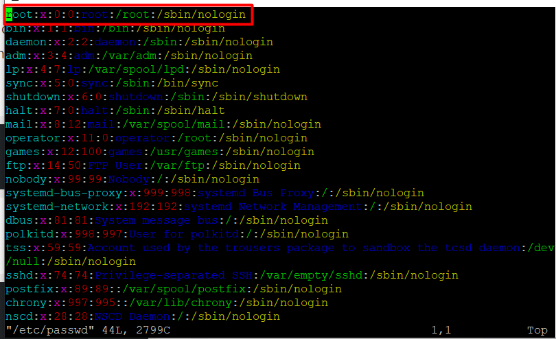
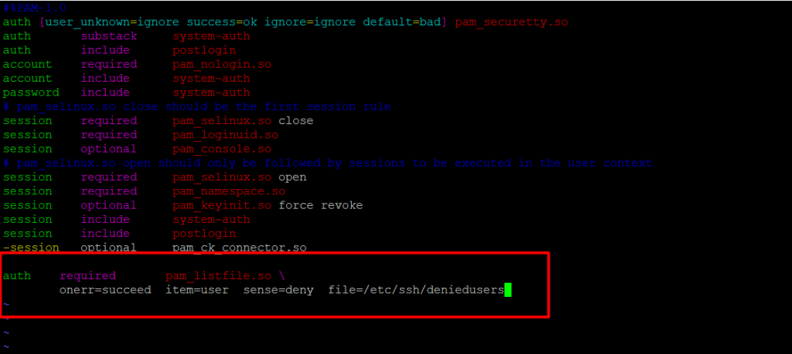

**Description**

Disabling the Root Account method will help you to Disabling the Root Account in Linux, The root account is the ultimate account on a [Linux](https://utho.com/docs/tutorial/category/linux-tutorial/) and other Unix-like operating systems. This account has complete read, write, and execute rights for all files and commands on a system, giving it access to all the system has to offer. It may be used to conduct any sort of action on a system; for example, it can be used to create/update/access/delete other users' accounts, install/remove/upgrade software packages, and so much more.

Because the root user has absolute privileges, all acts he/she takes are essential on a system. In this aspect, any faults committed by the root user might have significant repercussions for the system's ability to function normally. In addition, this account may potentially be exploited by using it incorrectly or inappropriately either unintentionally, deliberately, or via faked ignorance of regulations.

As a result, it is recommended that you disable root access on your Linux server. As an alternative, you should create an administrative account that should be configured to gain root user privileges by using the sudo command. This account should then be used to carry out essential tasks on the server.

In this post, we will describe four methods to prevent root user account login in Linux.

**NOTE:**Be careful to establish an administrative account using the useradd command that can utilise sudo to achieve root user rights before you limit access to the root account. Then, give this user account a strong password. Create User's Home Directory is what the option -m does, and -c enables you to write a comment:

```
 # useradd -m -c "Admin User" microhost_com 
```

```
 # passwd microhost_com 
```

Next, add this user to the right group of system administrators by using the usermod command with the -a and -G switches (wheel or sudo, depending on your Linux distribution):

```
#usermod -aG wheel microhost_com 
```

Once a user with administrative capabilities has been established, switch to that account to prevent root access.

```
# su microhost_com 
```

## Change the root user's shell.

The most straightforward way to block root user login is to alter its shell from /bin/bash or /bin/bash (or any other shell that permits user login) to /sbin/nologin, in the /etc/passwd file, which you can open for editing using any of your favorite command line editors as shown.

```
# sudo vim /etc/passwd 
```

Modify this line:

```
 root:x:0:0:root:/root:/bin/bash  
to  
root:x:0:0:root:/root:/sbin/nologin 
```



Save and close the file.

When a root user checks in from now on, he or she will get the notification "This account is presently not available." This is the default message, but you may customise it by editing the file /etc/nologin.txt.

This strategy works only with programmes that require a shell for user login; otherwise, sudo, ftp, and email clients can gain access to the root account.

## Disable root login via Console Device (TTY)

The second way employs a PAM module called pam securetty, which grants root access only if the user is logging in on a "secure" TTY, as described by the listing in /etc/securetty.

The aforementioned file allows you to select which [TTY](https://www.howtogeek.com/428174/what-is-a-tty-on-linux-and-how-to-use-the-tty-command/) devices the root user is authorised to login on; emptying this file forbids root login on any devices connected to the computer system.

Run to create a blank file.

```
# sudo mv /etc/securetty /etc/securetty.orig 
```

```
# sudo touch /etc/securetty
```

```
# sudo chmod 600 /etc/securetty 
```

This technique has some restrictions in that it only impacts login, display managers (such as gdm, kdm, and xdm), and other network services that launch a TTY. The root account will be accessible to programmes such as su, sudo, ssh, and other relevant openssh tools.

## Disabl SSH Root Login

The commonest approach to getting to far off servers or VPSs is by means of SSH and to hinder root client login under it, you really want to alter the/and so /etc/ssh/sshd\_config file.

```
# sudo vim /etc/ssh/sshd_config 
```

Then uncomment (in the event that it is remarked) the order PermitRootLogin and set its worth to no as displayed in the screenshot.


Whenever you are finished, save and close the document. Then restart the sshd administration to apply the new change in configurations.

```
# sudo systemctl restart sshd 
```

As you may definitely be aware, this technique just influences openssh instruments set, projects, for example, ssh, scp, sftp will be obstructed from getting to the root account.

## Restrict root Acess to Services Through PAM

Pluggable Authentication Modules (PAM in short) is a concentrated, pluggable, measured, and adaptable technique for authentication on Linux frameworks. PAM, through the/lib/security/pam\_listfile.so module, bestows on extraordinary adaptability in limiting the honors of explicit records.

The above module can be used to reference a rundown of clients who are not allowed to sign in by means of some objective administrations, for example, login, ssh and any PAM mindful projects.

For this situation, we need to disable root client admittance to a framework, by confining admittance to login and sshd administrations. First open and edit the record for the objective help in the/etc/pam.d/directory as displayed.

```
# sudo vim /etc/pam.d/login 
```

or

```
# sudo vim /etc/pam.d/sshd 
```

Next, add the configuration underneath in both files.

```
 auth required pam_listfile.so   
onerr=succeed item=user sense=deny file=/etc/ssh/deniedusers 
```



At the point when you are finished, save and close each file. Then, at that point, make the plain file/etc/ssh/deniedusers which ought to contain one item for every line and not world intelligible.

Add the name root in it, then, at that point, save and close it.

```
# sudo vim /etc/ssh/deniedusers 
```

Likewise set the required permissions on this file.

```
# sudo chmod 600 /etc/ssh/deniedusers 
```

This strategy just influence projects and administrations that are PAM aware. You can obstruct root admittance to the system via ftp and email clients and more.

For more information, counsel the relevant man pages.

```
# man pam_securetty 
```

```
# man sshd_config 
```

```
# man pam
```

In this article, we have made sense of four different ways of disabling the root user login (or account) in Linux.

Must Read : [For Application Data Storage on Fedora 14, Use MongoDB](https://utho.com/docs/tutorial/for-application-data-storage-on-fedora-14-use-mongodb/)

Thank You
