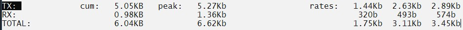

<figure>


<figcaption>

Explanation of iftop command

</figcaption>

</figure>

```
Description:
```
With iftop, it is easy to keep an eye on your network. It shows a table of how much [bandwidth](http://How to check Bandwidth consumption in Microhost panel) each host is using right now. iftop puts the pair of hosts that are causing the most traffic at the top of the list, making it easier to find the hosts that are causing the network to slow down.

Iftop shows the send and receive data transfer rates for the last two seconds, ten seconds, and forty seconds.

It displays bandwidth usage on an interface by host.

iftop listens to network traffic on a named interface, or on the first [interface](https://en.wikipedia.org/wiki/Interface_(computing)#:~:text=In%20computing%2C%20an%20interface%20is,humans%2C%20and%20combinations%20of%20these.) it can find that looks like an external interface if none is specified, and displays a table of current bandwidth usage by pairs of hosts.

### Prerequesties:

User must be either super user or any normal user with SUDO privileges.

### How to download iftop

In Redhat/ Fedora/ CentOS:

```
# yum install epel-release -y  
yum install iftop -y 
```

In Ubuntu/ Debian:

```
# apt install iftop 
```

## Explanation of iftop command

To moniter the trafic on default interface of the machine

```
 iftop 
```

<figure>


<figcaption>

After installation of iftop, the output

</figcaption>

</figure>

iftop uses the whole screen to show how the network is being used when it is running. At the top of the screen, there is a logarithmic scale for the bar graph that shows how much traffic there is.

The main part of the screen shows, for each pair of hosts, how fast data was sent and received over the last 2, 10, and 40 seconds. Arrows, like the ones between = and =>, show the direction of data flow.

For example, in above screenshot, it shows traffic from ubuntu22.bbrouter to Nebula.bbrouter on the first line. This traffic averaged 1.11Kbit/s in the last 2 seconds, about 3.4 Kb/s in the last 10s, and 3.45Kb/s in the last 40s. Similarly, 160b/s in last 2 seconds, 731b/s in last 10 seconds and 731 b/s data were sent in the other direction. On the actual display, part of each line is backwards to show the average amount of traffic over the last 10 seconds. You might see something like this, where host foo sends HTTP requests to bar over and over again, and bar sends back so much data that it fills up a 2Mbit/s link.  
By default, the pairs of hosts with the most traffic (10-second average) are shown at the top of the list.

At the bottom of the screen, you can see different totals, such as the peak traffic over the last 40 seconds, the total traffic transferred (after filtering), and the average transfer rates over 2 seconds, 10 seconds, and 40 seconds.

If you have multiple interfaces to listen, then most probably you would like to moniter the traffic on a specific interface of the machine.

```
 iftop -i interface_name 
```

At the bottom of the iftop output:

<figure>



<figcaption>

Receive and Sent data

</figcaption>

</figure>

At the bottom of the screen is a section that shows the overall traffic statistics.

- TX: The amount of traffic that was sent. Iftop command shows a cummulative or in simple words, total amount of bandwidth used by each type of traffic (cum).

- RX: Traffic amount received,

- TOTAL: the grand total of the traffic( TX plus RX) .

- PEAK: the peak amount of bandwidth used.

- AVG: the average amount of bandwidth used over the last 2, 10, and 40 seconds (avg).

To see options, which you can use to monitor your network traffic more effectively.

```
# iftop -h 
```
