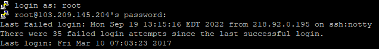
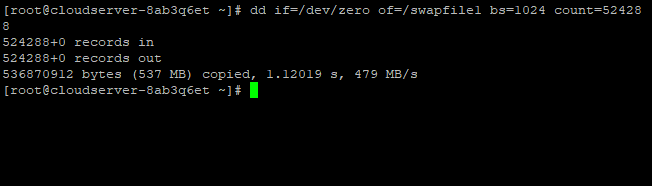
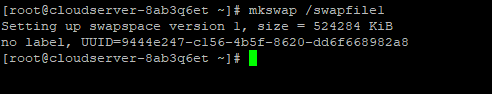
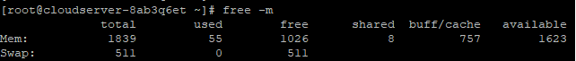
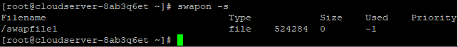

## Introduction

In this article, you will learn how to add a swap file in linux.

A [swap](https://en.wikipedia.org/wiki/Swap) file is **a system file that creates temporary storage space on a solid-state drive or hard disk when the system runs low on memory**. The file swaps a section of RAM storage from an idle program and frees up memory for other programs.

The term "swap space" can refer to either a partition on the disc or a file. During the installation process, users have the ability to create a swap space, or at any other point in the future if they so want. There are two applications for swap space: the first is to extend the virtual memory beyond the amount of installed physical memory (RAM), and the second is to provide support for suspending to disc.

## Step 1 – Login as the Root User



## Step 2 – Create Storage File

To make a 512MB swap file (1024 \* 512MB = 524288 block size), run the following command:

```
#dd if=/dev/zero of=/swapfile1 bs=1024 count=524288
```



## Step 3 – Secure swap file

For security reasons, enter the following file permissions:

```
#chown root:root /swapfile1
```

```
#chmod 0600 /swapfile1
```

A globally accessible swap file is a major local vulnerability. The commands above ensure that only the root user can read and write to the file.

## Step 4 – Set up a Linux swap area

To create a swap file in Linux, enter the following command:

```
#mkswap /swapfile1
```



## Step 5 – Enabling the swap file

Finally, immediately activate the /swapfile1 swap space by typing:

```
#swapon /swapfile1
```

## Step 6 – Update /etc/fstab file

Adding a line to the /etc/fstab file will make /swapfile1 accessible following a reboot of the Linux system. To read this file, launch a text editor like vi.

```
#vi /etc/fstab
```

Please add the following clause:

/swapfile1 none swap sw 0 0


Using escape colon wq, save the file and close it.

## How do I verify Linux swap file is activated or not?

Simply use the free command:

```
#free -m
```



## How can I display swap usage summary on Linux?

Type the following swapon command:

```
#swapon -s
```



## Conclusion

Hopefully, you have learned how to add a swap file in linux.

Also read: [How to prevent a user from login in Linux](https://utho.com/docs/tutorial/how-to-prevent-a-user-from-login-in-linux/)

Thank You 🙂
