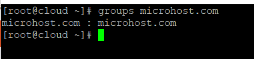
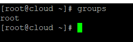
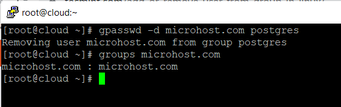

**Description**

Linux is a multi-user system by default, which means that many people can connect to it at the same time and work. One of the most important jobs of a system administrator is to manage users. On a Linux system, user management includes creating, updating, and deleting user accounts and user groups.

In this short article, you will learn how to add or remove a user from a group in a Linux system.

**Need to check User group**

Just type in the following groups command to see whether you're a member of a certain user group:

```
#groups microhost.com
```



\*Simply execute the groups command without providing any arguments in order to examine your own groups.

```
#groups
```



**Add a User to a Group**

Make sure that the user in question already exists on the system before attempting to add them to a group. Use the usermod command with the -a flag, which informs usermod to add a user to the supplemental group(s), and the -G option, which specifies the actual groups in the following format, in order to add a user to a specific group. For further information, see the usermod man page.

```
#usermod -aG postgres microhost.com
```

```
#groups microhost.com
```


**Remove a User from a Group**

```
#gpasswd -d microhost.com postgres
```

```
#groups microhost.com
```



The deluser command lets you take a user out of a certain group.

```
#sudo deluser microhost.com postgres
```

**Thank You**
