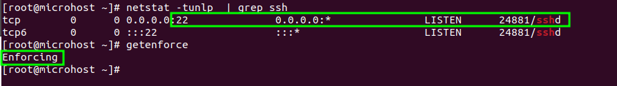
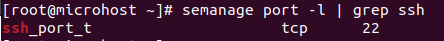
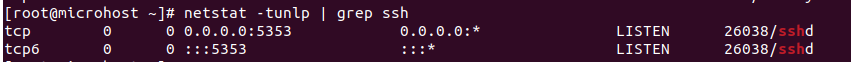

<figure>


<figcaption>

How to change SSH port when SELinux policy is enabled

</figcaption>

</figure>

In this tutorial, you will learn how to change SSH port when SELinux policy is enabled in CentOS or RedHat or Fedora flavour. When SELinux is operating in enforcing mode, the SELinux policy is enforced and access is denied based on [SELinux policy rules](https://docs.oracle.com/en/operating-systems/oracle-linux/selinux/selinux-AdministeringSELinuxPolicies.html#ol-set-bool-selinux). TCP port 22 is the standard SSH port on the majority of Linux and Unix systems. This is readily modifiable to a port not used by any other applications on the system.

When SELinux is operating in Enforcing mode, the to-be-set port must be relabeled so that Policy rules controlling access will permit the ssh service to bind.

## Prerequisites:

- Super user or any normal user with SUDO privileges
- Any utility to edit a file such as vi, vim or nano

## Steps to change the port when SeLinux policy is enforced

Step 1: Check the current port of ssh service and selinux mode

```
netstat -tunlp | grep ssh
getenforce
```
<figure>



<figcaption>

Default port of ssh and selinux policy

</figcaption>

</figure>

Step 2: Now goto the SSH configuration file and navigate to keyword- "Port" and if the existing line is commented then make a new entry in next line like as shown in below picture

```
vim /etc/ssh/sshd_config
```
<figure>


<figcaption>

Configuration file of SSH

</figcaption>

</figure>

Here, we want to change our default port from 22 to 5353. If you want to change the default port to any other port number, just mention after "Port".

Now if your restart the SSH services, The service will not restart and will give you the below error in journalctl -xe

<figure>


<figcaption>

SSh sevices restart without changing the labeling in semanage

</figcaption>

</figure>

Step 3: Now check the labeled port for SSH service in SELinux policy

```
semanage port -l | grep ssh
```
<figure>



<figcaption>

SSH port labeled in SELinux policy

</figcaption>

</figure>

Step 4: Now add another port lable in selinux policy for SSh service. This will enable you to run your SSH service in either 22 or 5353 port number.

```
semanage port -a -p tcp -t ssh_port_t 5353
```
Step 5: Now restart the SSH service by using systemctl command as below

```
systemctl restart sshd
```
<figure>


<figcaption>

Service restarted successfully after enabeling the port in selinux policy

</figcaption>

</figure>

Step 6: To crosscheck the listening port of SSH, after follow the above steps, you can check this [using netstat command](https://utho.com/docs/tutorial/how-to-install-netstat-on-ubuntu-20-04-lts/).

```
netstat -tunlp | grep ssh
```
<figure>



<figcaption>

Port changed successfully when selinux policy is enabled

</figcaption>

</figure>

Step 7: If you want to delete the port label from Selinux, you can do so using below command. But remember that, after executing the next command you will not be able to restart the service without change the port number in SSH configuration file.

```
semanage port -d -t ssh_port_t -p tcp 5353
```
And this is how you can change the port number of SSH when Selinux policy is enabled.
