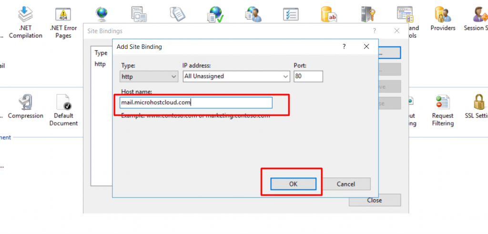
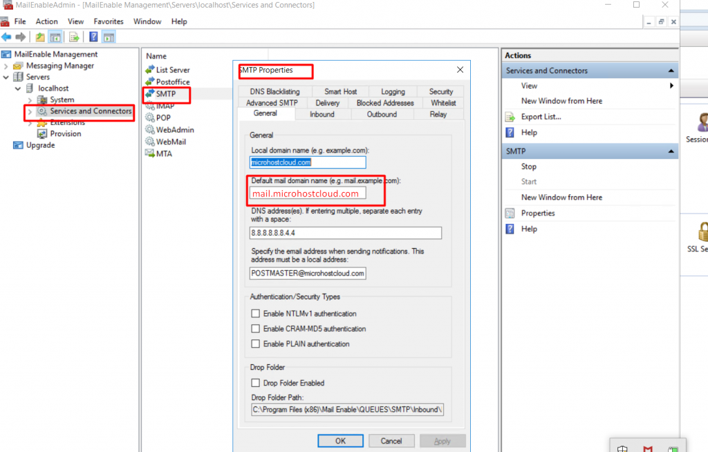

**In the configuration section, we will see the creation of a webmail URL for Mailenable in IIS. After creation, we would be able to access the Mailenable using a URL from outside the localhost.**

**Step 1:** While installing the Mailenable, IIS default sites for Mailenable have already been created. Please see the screenshot below.

Step 2: Now we have to edit the binding of the MailEnable WebMail site. Please see the screenshot for your reference.

Step 3: While clicking on bindings, a new window will appear where we have to add the binding of our domain. While clicking on ”Add”, a new window will appear as below: Please see the screenshot below.

Step 4: Now we have to point the webmail URL to the server's IP. For example, if my webmail URL is mail.microhostcloud.com and my server IP is 103.209.144.155, then we have to add “A record” for mail.microhostcloud.com to 103.209.144.155.

**NOTE: DNS propagation will take 4 to 8 hours.**

Step 5: We have to setup a default mail domain, which will be used for email communication with external domains. First we have to open the Mailenable console by searching for “Mailenable” in the Windows search bar. Afterward, navigate to Servers->localhost->Services and Connectors->SMTP.

Step 6: Now in the properties section, we have to give the default mail domain and click on “ok” as per the screenshot.

We have completed the configuration section of Mailenable.

Thank you :)
