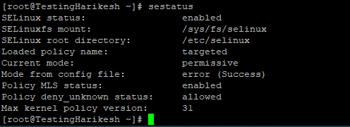
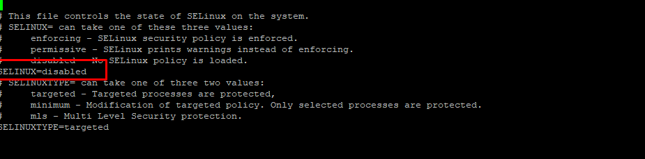

In this article you will learn How to Disable SELinux Temporarily or Permanently, SELinux, which stands for "Security Enhanced [Linux,](https://utho.com/docs/tutorial/category/linux-tutorial/)" is a security module for the Linux kernel that gives users and administrators more control over access controls. It lets people in based on the rules of SELinux policy.

SELinux policy rules say how processes and users interact with each other and with files.

Access is denied when no SELinux policy rule explicitly allows it, like when a process tries to open a file.

SELinux has three modes:

- Enforcing: SELinux allows access based on SELinux policy rules.
- Permissive: SELinux only logs actions that would have been denied if running in enforcing mode.
- Disabled: No SELinux policy is loaded.

By default, in CentOS 7, SELinux is enabled and in enforcing mode

It is best to keep SELinux in enforcing mode, but you may need to switch it to permissive mode or turn it off completely in some situations.

In this tutorial, we will show you how to disable SELinux on CentOS 7 systems.

## Prerequisites [#](https://linuxize.com/post/how-to-disable-selinux-on-centos-7/#prerequisites)

Before starting with the tutorial, make sure you are logged in as a root user or sudo privileges

Check the SELinux Status 

```
 sestatus 
```

After enter the the command output will be like below given.



Now, for disabled the Selinux we need to use below given command

```
 vi /etc/selinux/config 
```

After enter the command need to change on the place of enabled to disabled like below given.



After that we need to restart the server hit the below given command.

```
 sestatus 
```

After enter the command outpur will show like below.


Conclusion [#](https://linuxize.com/post/how-to-disable-selinux-on-centos-7/#conclusion)

In this tutorial, you learned how to permanently disable SELinux on CentOS 7 systems.

Thank you :)
