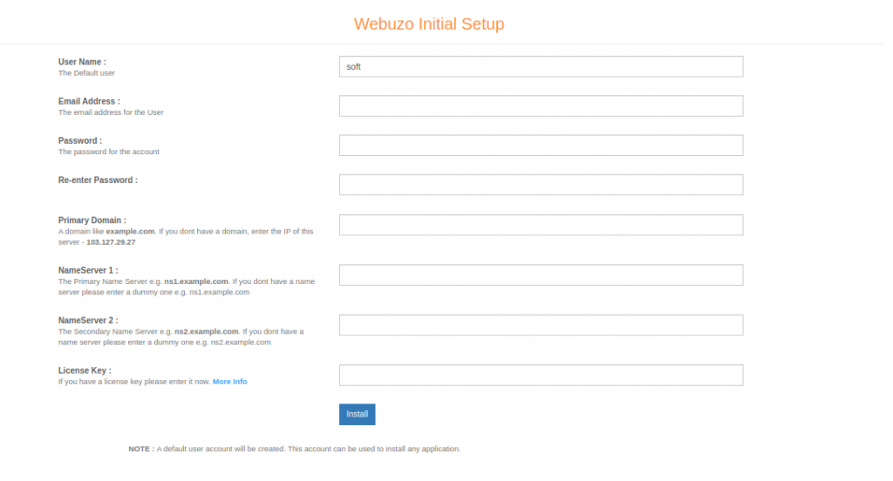

Webuzo is multi user Control panel built for Hosting Providers resellers and website owners. Its powerful and easy to use, so we are going to install webuzo on centos7. Webuzo is perfect for use in enterprises, small to medium business situations and just about 240 web applications are supported by Webuzo.For using Webuzo there is no system admin skills are required.

Step 1. Update the Server.

```
 #yum update -y 
```

Step 2: Use this command to get Webuzo installer.

```
 #  wget -N [http://files.webuzo.com/install.sh](http://files.webuzo.com/install.sh) 
```

Step 3: Provide Execute permission on installer.sh file.

```
 #chmod +x install.sh 
```

Step 4. Now run the installer.sh.

```
 # ./install.sh 
```

Installation Done on server.


Step 5: Now Access Webuzo in browser.

With SSL :[https://Server\_IP:200](http://server_ip:2002/)3  

Without SSL : [http://Server\_Ip:2002](http://server_ip:2002/)

Step 6. Now Complete installation by Providing all details.



Thank you!!
