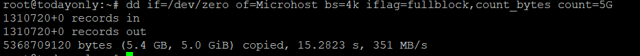
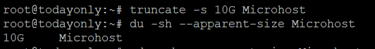
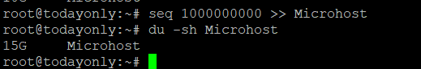

**Description**

In this article we will guide How to Make a Large File in [Linux](https://utho.com/docs/tutorial/find-out-all-live-hosts-ip-addresses-connected-on-network-in-linux/).

In this article you will know to Make a Large File in Linux. There are many reasons why you might want to make a big file in Linux. One scenario could be testing the tools for keeping track of disc space to see if they work right. If your system doesn't have a lot of data, it will be hard to test the disc monitoring features. So, when this happens, you can quickly make a big fake file to test your disc monitoring software.

In the same way, you might need to make a big file on your Linux system for some other reason. So, we'll look at some of the easy-to-find tools that can be used to do this job quickly and easily.

Follow the below steps to learn How to Make a Large File in [Linux](https://en.wikipedia.org/wiki/Linux)

## Using the fallocate command

Most likely, this is the fastest way to make a big file. You can make a big file with the syntax fallocate -l "size" "file name." Here, we use the fallocate -l 1G Microhost file command to make an 1G file called Microhost. Use the du -sh Microhost command, as shown below, to find out how big the file is. Check out the manual page for more options.

```
fallocate -l 1G Microhost
```


## Using dd command

This is a well-known method in [Linux](https://en.wikipedia.org/wiki/Linux) that has likely been used for a few years. The dd command writes the blocks from the input file to the output file. You might have used this command to make a copy of the data on your hard drive. Here, we're increasing the size of the output file called "Microhost" by writing the blocks from the input "/dev/zero" file to a count of 8G and using a 4K block size. But it is important to note that this command is slower than fallocate and truncate because I/O operations take a long time.

```
dd if=/dev/zero of=Microhost bs=4k iflag=fullblock,count_bytes count=5G
```


You can determine the file's size using the du -sh Microhost command, as seen below.

```
du -sh Microhost
```


## truncate command

The truncate command is another very useful tool that you might want to use. The truncate -s size> file name> syntax is used to make a file. With the truncate -s 10G Mcrohosti command, we are making a file called Microhost that is 10G in size. The du -sh —apparent-size Microhost command can be used to find out how big the file is.

It's important to know that truncate always makes files with an apparent size. This means that it doesn't actually store any data, but makes the OS think it does, so the file size grows.

```
truncate -s 10G Microhost
```
```
du -sh --apparent-size Microhost
```


## seq command

This is likely one of the slower ways to do something. Using this method, you can add long sequences to the file, which will make it much bigger in the end. You can use the sequence in a way that makes the size you want. The bigger the sequence, the bigger the size. For example, here we're using the seq 1000000000 >> large file command to write sequence 1000000000 to a [Microhost](https://utho.com/). This will make a file about 15GB in size, but the process will be much slower than the others. Check out the MAN page for more options.

```
seq 1000000000 >> Microhost
```
```
du -sh Microhost
```


I hope you really understand all the steps How to Make a Large File in Linux.

Must Read:- https://utho.com/docs/wp-admin/post.php?post=8387&action=edit

Thankyou
