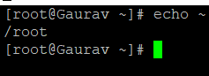
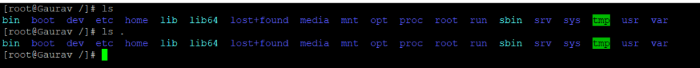
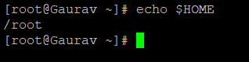
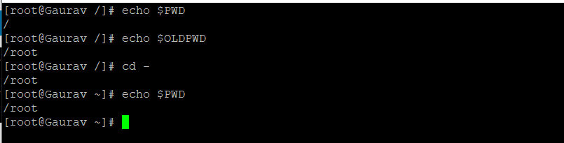

###### **Description**

The user's home directory, the current working directory, and the previous working directory are just some of the special directories that a Linux user is bound to work with a significant number of times when using the shell command line.

Therefore, having the ability to quickly access or zero in on these directories by utilising specific approaches that are unique to [Linux](https://utho.com/docs/tutorial/category/linux-tutorial/) can be a useful bonus skill for any user, regardless of experience level.

A user can identify his or her home directory, current working directory, and previous working directory from the shell by using special shell characters and environment variables. In this beginner's guide, we will look at how a user can do this.

## Using Particular Characters from the Shell

When we work with directories using the command line, there are particular characters that the shell recognises and interprets as meaning something specific. The tilde, or, will be our first topic of discussion because it is the symbol that allows access to the home directory of the currently logged-in user:

```
#echo ~
```



On the command line, the second character is the dot (.) character, which represents the directory that the user is currently working in. You can see that the output of the commands ls and ls. produce the same result, which is a listing of the contents of the directory that is currently being used as the working directory.

```
#ls
```

```
#ls .
```



The third set of special characters is comprised of two dots separated by a semicolon (..), which denotes the directory that is located directly above the user's current working directory.

The directory that can be seen above /var in the image below is the root directory (/). Because of this, when we use the ls command in the manner described below, the contents of the root directory are listed:

```
#ls ..
```


## Using Environmental Variables

In addition to the characters that were just discussed, there are also some environmental variables that are designed to cooperate with the directories that we are concentrating on. In the following part of this tutorial, we are going to discuss some of the most significant environmental variables that can be used to recognise directories via the command line.

You can verify that the value of $HOME is the same as the value of the tilde character (), which is the home directory of the currently logged in user, by using the echo command in the following manner:

```
#echo $HOME
```



$PWD is an abbreviation that stands for "[Print Working Directory](https://en.wikipedia.org/wiki/Working_directory)," and as its name suggests, it displays the complete directory path of the current working directory in the shell command line, as shown in the following example:

```
#echo $PWD
```

```
#echo $PWD
```

## Using Only the Most Essential cd Commands

In addition, you may access both your home directory and the directory in which you were working before by using a few simple commands. On the command line, for instance, if you are in any area of your file system, entering cd and then pressing Enter will bring you to your home directory:

```
#echo $PWD
```

```
#cd
```

```
#echo $PWD
```


Using the cd - command, as shown below, is another option for moving back to the previous working directory:

```
#echo $PWD
```  
```
#echo $OLDPWD
```  
```
#cd -
```  
```
#echo $PWD
```



In this article, we went over some basic but helpful command line tips for new Linux users to recognise various special folders from inside the shell command line. These recommendations were provided for new Linux users.

##### **Thank You**
