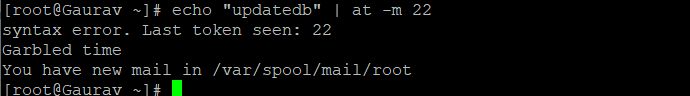
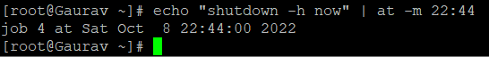

###### **Description**

The at command can be used as an alternative to the cron job scheduler since it enables you to schedule a command to run once at a specified time without requiring you to change a configuration file.

The only prerequisite is to download and install this tool, then start it and make sure its execution is enabled.

## Installing Package:

```
# yum install -y at 
```


Next, run the at service at boot time and make sure it's enabled.

## Start service:

```
# systemctl start atd 
```

```
# systemctl enable atd 
```

## Set at Jobs:

When atd is up and running, you will have the ability to schedule any command or job using the instructions below. When the next minute begins (so if the current time is 22:32:13, the command will be executed at 22:33:00), we want to send four ping probes to www.google.com and then report the results to the user who invoked the command by sending them an email (-m, which requires [Postfix](https://en.wikipedia.org/wiki/Postfix_(software)) or an equivalent programme):

```
# echo "ping -c 4 www.google.com" | at -m now + 1 minute 
```


In the event that you do not use the -m option, the command will still be carried out, but nothing will be written to the standard output. On the other hand, you have the option of redirecting the output to a file instead.

If you do not use the -m option, the command will still be performed, but nothing will be displayed to the standard output. However, another option available to you is to save the result to a file rather than displaying it directly.

As an example,

Follow these steps to run updatedb tonight at 10 o'clock (or tomorrow if the current date is later than 10 o'clock):

```
# echo "updatedb" | at -m 22 
```



In order to shutdown the machine at 22:44 tonight (these instructions follow the same format as the one given in the previous example):



Using the plus sign and the time specification that you want to postpone the execution by, you may also delay it by minutes, hours, days, weeks, months, or years, just as in the first example.

The POSIX standard governs time requirements and standards.

- If you wish to run a command or carry out a certain activity at a specific time just once, you should use the at command rather than the cron job scheduler. This is a good rule of thumb to follow. Utilize cron for all other circumstances.

Know, [How to remove FTP account in plesk](https://utho.com/docs/tutorial/how-to-remove-ftp-account-in-plesk/)

###### **Thank You**
