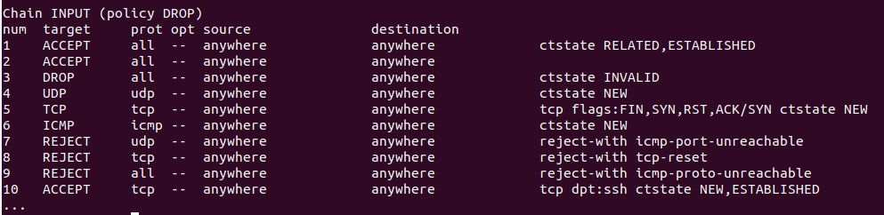

<figure>


<figcaption>

How to use IPTABLES firewall in Linux

</figcaption>

</figure>

## Description

In this tutorial, you will learn how to use the IPTABLES firewall in Linux. The iptables command is a powerful way to control your Linux firewall on your own computer. It gives you thousands of options for managing network traffic through a simple syntax.

Here, we need to say that iptables rules take effect as soon as they are entered. There is no configuration to reload or daemon to restart. Because of this, you must be very careful, or you could lock yourself out of the system you are using. Rules that let you into the system should always come before those that don't.

> Note: When working with firewalls, be careful not to block [SSH traffic](https://www.ibm.com/docs/SSSHEC_7.6.0/deploy/ref/ref_defaultopenports.html#:~:text=SSH%20port%2022&text=The%20port%20is%20used%20for,is%20encrypted%20using%20password%20authentication.) and lock yourself out of your own server (port :22, by default). If your firewall settings cause you to lose access, you may need to connect to it through an out-of-band console to get access back.

## Prerequisites

- Super user( root) or any normal user with SUDO privileges.
- Binary iptables installed Linux server

## Listing Rules by Specification

Let's start with a primer on enumerating regulations. Your current iptables rules can be viewed in a table or as a list of rule parameters. Similar results can be obtained using either approach.

Using the iptables command with the -S option will display a complete specification list of all currently active rules.

```
iptables -S
```
<figure>


<figcaption>

output of above command

</figcaption>

</figure>

Without the iptables command in front of them, the output looks identical to the original commands used to construct them. If you've ever worked with iptables-persistent or iptables save, you'll recognise this as being quite similar to the iptables rules configuration files.

### Listing a Specific Chain

Following the -S option, you can enter the name of the chain you want to restrict the output to (INPUT, OUTPUT, TCP, etc.). This command would display all rule specifications in the TCP chain.

```
iptables -S TCP
```
<figure>


<figcaption>

output of the above command

</figcaption>

</figure>

This section will examine the alternative method of viewing the currently-running iptables rules, which is in the form of a rules table.

## Listing Rules as Tables

When listing the iptables rules, a table view can be helpful for contrasting the various options. Run the iptables command with the -L argument to see a table of all currently active rules.

```
iptables -L
```
All of the current rules will be displayed here, organised by chain.

Directly following the -L option, you can enter the name of the desired chain (INPUT, OUTPUT, TCP, etc.) to restrict the output to just that channel.

Have a look at this sample INPUT sequence:

```
iptables -L INPUT
```


Output begins with the chain's name (INPUT) and the default policy it uses (DROP). Each column's heading appears on the next line, and then the rules for the chain itself are presented. The following is a breakdown of what each heading means:

- **target:** The target tells the rule what to do if a packet matches the rule. A packet may be granted passage, rejected, recorded, or forwarded to another chain in order to be evaluated against additional rules.
- **Prot:** The protocol which could be TCP, UDP, ICMP, or "all."
- **opt:** This column, which shows IP choices, is rarely utilised.
- **source:** Indicative of the traffic's origin IP address or subnet, or any other
- **destination:** The packets' final Internet Protocol (IP) address or subnet, or any other

The rule's alternatives are given in the unlabeled final column. What doesn't fit in the other categories of the regulation. This information may include the packet's source and destination ports as well as its connection status.

## Deleting Rules by Specification

In iptables, rule deletion can be accomplished in a few different ways. You can do this by issuing the iptables command with the -D option and the rule specification. The output of iptables -S, the rules list, can be helpful if you want to eliminate rules using this approach.

Use this command, for instance, to remove the rule that discards invalid incoming packets (-A INPUT -m conntrack —ctstate INVALID -j DROP):

```
sudo iptables -D INPUT -m conntrack --ctstate INVALID -j DROP
```
## Deleting Rules by Chain and Number

Iptables rules can also be removed by their chain and line number. If you list the rules in a table and specify the —line-numbers option, you will be able to see the line numbers for each rule.

```
iptables -L --line-numbers
```


You should take note of the rule's chain and line number once you've decided which rule to remove. Next, enter iptables -D followed by the chain number and rule number.

For example, if we want to delete the input rule that drops invalid packets, we can see that it is rule 3 of the INPUT chain. So this command should be run:

```
iptables -D INPUT 3
```
Now that you know how to delete individual firewall rules, let’s go over how you can _flush_ chains of rules.

In this tutorial, you have learned How to use IPTABLES firewall in Linux.

Also Read: [How to install Apache on CentOS 7](https://utho.com/docs/tutorial/how-to-install-apache-on-centos-7/), [Change SSH Default Port 22 to Custom Port](https://utho.com/docs/tutorial/change-ssh-default-port-22-to-custom-port/)
