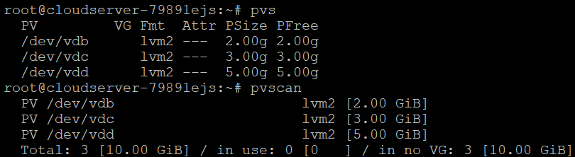
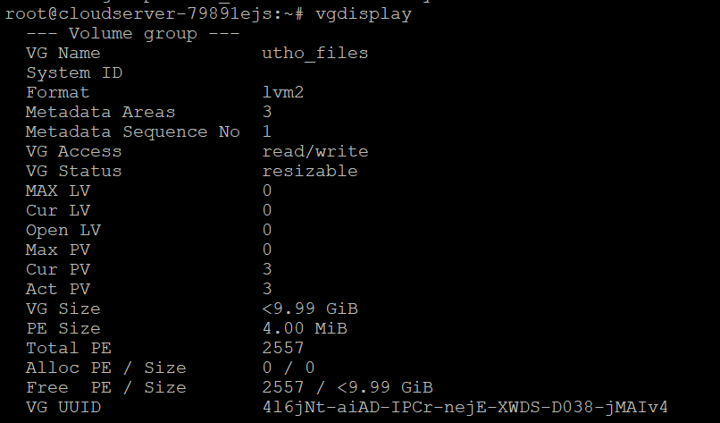
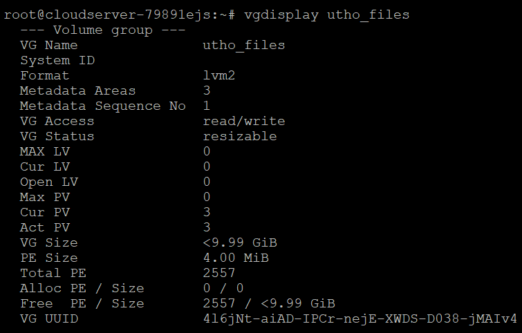
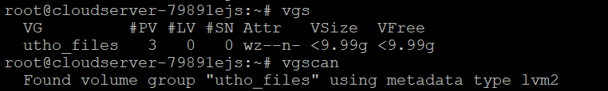
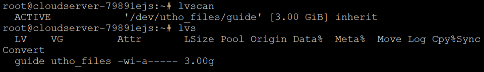
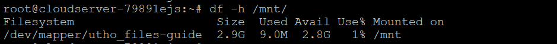

## Introduction

In this article you will learn Logical volume manager in linux ([LVM](https://en.wikipedia.org/wiki/Logical_Volume_Manager_(Linux))) Guide for beginners.

Linux's block storage is managed by Logical Volume Manager (LVM). When compared to normal partitions, LVM manages storage in a different and more efficient way.

LVM takes room from partitions or whole discs (called "Physical Volumes") and puts it together into a logical container (called a "Volume Group"). Logical Volumes are logical parts that make up the rest of the Volume Group.

To put it simply, LVM puts all of your storage space into a pool and lets you use that pool to make volumes (Logical Volumes).

LVM is better than standard partitions because it gives you more options and freedom. It lets Logical Groups and Logical Volumes be changed in size online. So, if one of your logical sections runs out of room, you can easily make it bigger by using space from the storage pool.

#### Layers of LVM

LVM adds a layer of abstraction between the physical storage and the file system. This makes it possible to change the size of the file system, spread it over multiple physical discs, and use any amount of disc space.

LVM makes divisions with three layers of abstraction.

Physical Volume, Volume Group, and Logical Volume.

**PHYSICAL VOLUME**

Everything starts with a disk. The physical volume is the first layer of abstraction that LVM uses to find the disk that has been marked for LVM actions. To put it simply, your disk should be set up as the physical drive if you want to work with LVM. It can be a whole hard drive or normal partitions made from that hard drive.

**VOLUME GROUP**

All the actual volume is added up to make the volume group. Let's say you have five disks that are each 1 TB in size. First, you will set up the five disks as real volumes, and then you will add them to the volume group.

Volume group will hold 5TB of space, which is how much room is available from all the physical volumes. You can set up logical splits from the volume group.

**LOGICAL VOLUMES**

You can make reasonable volumes out of the pool of space (Volume Group). Think of this as being the same as a typical disk divided.

#### Step 1: Set the physical volume to zero

**I added three different-sized disks, and the total is 10G.**

```
# lsblk /dev/vd\[b-e\]

```


**Use the pvcreate command with the name of the device as the argument to set up a disk as a physical volume.**

```
# pvcreate /dev/vdb /dev/vdc /dev/vdd

```


**You can run any of the following tools to see a list of physical volumes. Different things will come out of each order.**

**PVDISPLAY: The pvdisplay tool will tell you all about each physical volume, including which volume group it belongs to, its unique ID, and how much space it has.**

```
# pvdisplay

```


**PVS and PVSCAN are two tools that will tell you things like the size of the physical volume, the size of the volume group, and the size of the free space.**

```
# pvs

```

```
# pvscan

```



#### Step 2: Building combined a volume group

**Now I have three disks set up as a single physical drive that is 10GB in size. You should add these physical disks to a storage pool called a volume group.**

**To make a volume group, use the vgcreate command. You have to give the volume group a name. "utho\_files" is the name of the volume group in this case.**

```
# vgcreate utho\_files /dev/vd\[b-d\]

```


**Use any of the following commands to find out more about a volume group.**

```
# vgdisplay

```



```
# vgdisplay utho\_files

```



#### Step 3: Show Volume Group Information

**The vgs and vgscan commands will tell you about all of the available volume groups, the amount of physical volumes and logical volumes, as well as the size of the allocated and free space in the volume group.**

```
# vgs

```

```
# vgscan

```



#### Step 4: Create Logical volumes

**I already said that logical volumes are like disk sections. Now, the "utho\_files" pool (volume group) has almost 10GB of free room. On top of this volume group, we'll build logical volumes, format the volume with the ext4 file system, mount and use the volume.**

**You can use the lvcreate command to make the logical disk. Here is a general description of how the lvcreate tool works.**

```
# lvcreate -L <volume-size> -n <logical-volume-name> <volume-group>

```

Here,

- **`-L <volume-size>`** => size in KB, MB, GB

- **`-n <logical-volume-name>`** => Name for your volume

- **`<volume-group>`** => Which volume group to be used

Now I am creating a logical volume with **3GB** size. I named the logical volume **"guide"**.

```
# lvcreate -L 3GB -n guide utho\_files

```


#### Step 5: Display information of logical volumes

**You can use any of the following commands to see details about logical volumes.**

**The lvdisplay command gives you specific information about the logical volume, the associated volume group, the volume size, the logical volume path, and so on.**

```
# lvdisplay

```

```
# lvdisplay guide

```


**The lvscan and lvs commands will also give you some basic details about the logical volumes.**

```
# lvscan

```

```
# lvs

```



#### Step 6 - Format and Mount the Logical Volumes

**You need to set up a file system on the logical disk and mount it. Here, I'm using the ext4 file system to format the disk and mounting it under the /mnt/ directory.**

**Under /dev/volume-group/logical-volume, you should see the device file for logical volume. My device file will be called /dev/utho\_files/guide.**

```
# mkfs.ext4 /dev/utho\_files/guide

```


**Run the following command to mount the path. You can put the directory wherever you want to.**

```
# mount /dev/utho\_files/guide /mnt/

```

To see the volumes that are mounted, run:

```
# mount | grep -i guide

```


**You can also type df to get information about the mounted file system. You can see that the name of the file system is "volume name." With these names, it will be easy for you to figure out what the base volume is and what its group is.**

```
# df -h /mnt/

```



**You need to add an entry to the fstab in order to make the mount permanent even after you reboot the system.**

## Conclusion

Hopefully, you have learned Logical volume manager in linux (LVM) Guide for beginners.

**Also Read:** [How to Use Iperf to Test Network Performance](https://utho.com/docs/tutorial/how-to-use-iperf-to-test-network-performance/)

Thank You 🙂
