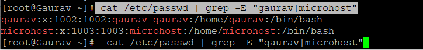

#### **Description**

adduser and useradd are Unix/Linux user account creation programmes. These instructions add one user at a time. Multiple user accounts? You need newusers then.

Newusers updates and creates new user accounts in bulk. It's designed for big IT settings where a system administrator must update or create many user accounts in bulk. It reads stdin (by default) or a file to update or create user accounts.

This article explains how to create several Linux user accounts in batch mode using Newusers.

To create users in bulk, use the same format as the password file.

```
#pw_name:pw_passwd:pw_uid:pw_gid:pw_gecos:pw_dir:pw_shell
```

\*pw\_name: username  
\*pw\_passwd: user’s password  
\*pw\_uid: user’s ID  
\*pw\_gid: user’s group ID  
\*pw\_gecos: defines comments sections.  
\*pw\_dir: defines the home directory of the user.  
\*pw\_shell: defines user’s default shell.

**Note:**Since the passwords in the input file are not encrypted, you need to protect it by giving it the right permissions. Only root should be able to read and write to it.

For instance, if you want to add user accounts named ravi and tecmint, you may create a file called users.txt and then follow the instructions given there.

```
#sudo vim abc.txt
```

Next, add the information of the user accounts to the file using the format that is shown here.


Save the file and give it the rights it needs.

```
#sudo chmod 0600 abc.txt
```

Execute the newusers command using the input file in order to add all of the user accounts described above at once.

```
#sudo newusers abc.txt
```

After first making an attempt to create or update the accounts that have been specified, the newusers programme will then write these changes to the user or group databases. Changes are not committed to the databases in the event that any errors occur, with the exception of those that occur during the final writes to the databases. This is the straightforward operation of the newusers command.

The newusers program first attempts to create or update the specified accounts, and then writes these changes to the user or group databases. In the event of errors, except for final writes to the databases, no changes are made to the databases. This is just the way the newusers command works.

If the above command is successful, check the / etc / passwd and / etc / groups files to confirm that the user accounts have been added as shown.

```
#cat /etc/passwd | grep -E "gaurav|microhost"
```



\*For more information, see the new user page.

```
#info newuser
```

### **Thank You**
