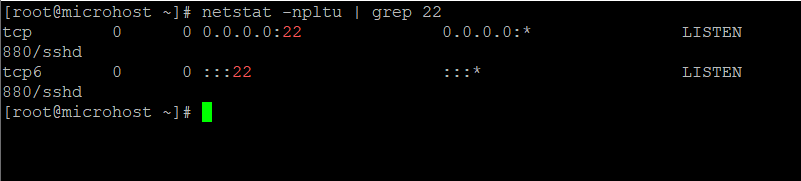

**Description**

Have you ever typed a command and quickly pressed Enter before realising you made a mistake? While you can repair the misspelling and explore the command history by using the up and down arrows, there is a quicker and easier method.

In this article, we'll go over a quick and easy way to deal with a command line typo. Assume you wanted to see if a service was listening on port 22, but you entered nestat instead of netstat.

You may easily modify the incorrect command to the correct one and run it as follows:

**NOTE:** Don't Miss: The Power of the "History Command" in Bash Shell in Linux

```
nestat -npltu | grep 22
```
```
^nestat^netstat
```
That's correct. You can rectify the error and run the command automatically by using two carat signs (they should be followed by the typo and the proper word, respectively).



It is important to note that this method only works for the previous command (the most recent command executed); attempting to repair a typo for a command run earlier would result in an error from the shell.

##### Summary

This is an excellent approach for overcoming time-wasting behaviours. As you can see, finding and correcting a typo is more easier and faster than going through command history.

Simply rectify the error with the caduceus signs, press the Enter button, and the proper instruction is executed immediately.

There could be various alternative methods for rectifying command line typos.
