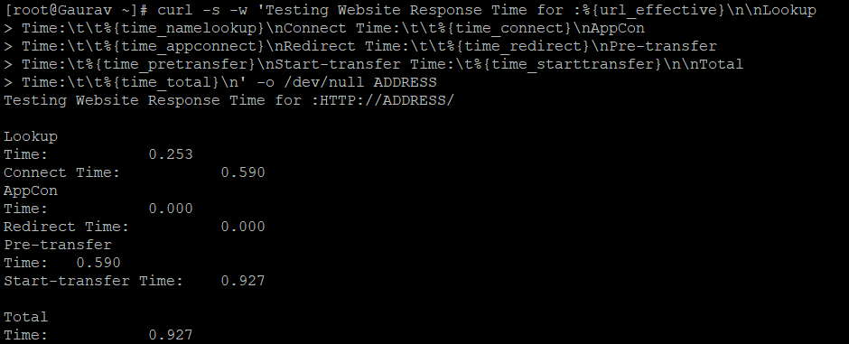
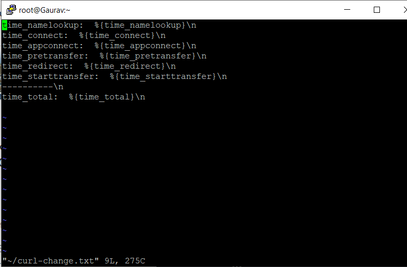
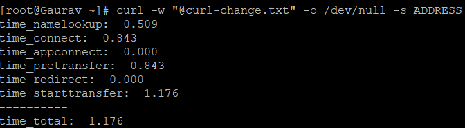
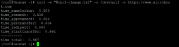

#### **Description**

The time it takes for a website to respond can have a big effect on how users feel, so if you are a web developer or a server administrator who is in charge of putting everything together, you need to make sure that users don't get frustrated while trying to use your site. There is a real "need for speed."

You will learn how to test the response time of a website using the command line in Linux by following the steps in this guide. In the following, we will demonstrate how to check the time required in seconds, specifically:

- for the purpose of name resolution
- in order to establish a TCP connection to the server.
- for the process of transferring the file to start.
- for the first byte to be transferred during the process.
- for the entirety of the procedure.

In addition, for HTTPS-enabled websites, we will also look at how to test the amount of time, in seconds, that it takes for a redirect as well as an SSL connection and handshake to be established with the server. It seems like a good idea, right? All right, then, let's get started.

cURL is a powerful command line tool that can transfer data from or to a server using a variety of different protocols, including FILE, FTP, FTPS, HTTP, HTTPS, and many others. The majority of the time, it is employed either as an HTTP header checker or as a command line downloader. Nevertheless, we are going to talk about one of its less well-known functionalities here.

- **cURL** has a useful option: -w, which prints information on stdout after a successful operation. It contains some variables that can be used to test the various response times listed above for a website.

We will make use of a few of the time-related variables, each of which may be passed in a specific format either as a literal string or contained within a file.

Now, open up your computer's terminal and type in the following command:

```
#sudo apt install curl -y
```

After the installation was complete, we are now able to test the loading time of a website that we require. Therefore, to test a website, the command is

```
#curl -s -w 'Testing Website Response Time for :%{url_effective}nnLookup Time:tt%{time_namelookup}nConnect Time:tt%{time_connect}nPre-transfer Time:t%{time_pretransfer}nStart-transfer Time:t%{time_starttransfer}nnTotal Time:tt%{time_total}n' -o /dev/null ADDRESS
```

In the preceding command, ADDRESS can either be the website's URL or its IP address; either one is acceptable.

**We used three options in the above command:**

- **\-s:** this will show an error if the command fails
- **\-w:** this will make the curl display result of the command
- **\-o:** output to a file

\*An HTTP website was put through its paces and the results are shown in the image below.


Let's say that in the event that we decide to test HTTPS websites, we want to include the following:

- The total amount of time spent on the SSL connection (time appconnect)
- The time used to calculate redirection (time riderect)

```
#curl -s -w 'Testing Website Response Time for :%{url_effective}nnLookup  
Time:tt%{time_namelookup}nConnect Time:tt%{time_connect}nAppCon  
Time:tt%{time_appconnect}nRedirect Time:tt%{time_redirect}nPre-transfer  
Time:t%{time_pretransfer}nStart-transfer Time:t%{time_starttransfer}nnTotal  
Time:tt%{time_total}n' -o /dev/null ADDRESS
```



\*So, if we don't want to run such a long command, we can make it easier by putting it in a curl-formatted file and calling it from the command line.

From this point on, we can observe how to make it. To begin, we need to input the command shown below in order to view the file using the vi text editor.

```
#vi ~/curl-change.txt
```

After that, copy the line and paste it into the file. After that, save the file and close it.

```
time_namelookup: %{time_namelookup}n  
time_connect: %{time_connect}n  
time_appconnect: %{time_appconnect}n  
time_pretransfer: %{time_pretransfer}n  
time_redirect: %{time_redirect}n  
time_starttransfer: %{time_starttransfer}n  
----------n  
time_total: %{time_total}n
```



Consequently, given that we have made the process simpler, we will need to carry out the command in the manner depicted in the following example.

```
#curl -w "@curl-change.txt" -o /dev/null -s ADDRESS
```



By utilising this command, we should be able to replace the ADDRESS with the URL or IP Address instead. This will work for websites that use either HTTP or HTTPS.

We will upload images by utilising the aforementioned script to run our website over HTTP and HTTPS.

- The image below is a website that uses HTTP.


- The image below is a website that uses HTTPS.



##### **Thank You**
