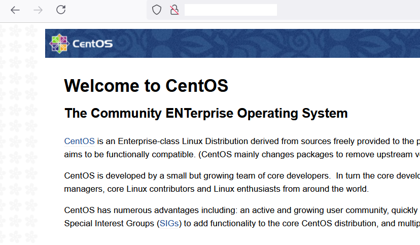

**Step 1:** Add Nginx repository

```
 # yum install epel-release 
```

**Step 2:**  Install Nginx using following command

```
 # yum install nginx 
```

**Step 3:** Start the service of Nginx

```
 # systemctl start nginx 
```

**Step 4:** Check status of Ngnix

```
 # systemctl status nginx 
```

**Step 5:** If you are running a firewall, run the following commands to allow HTTP and HTTPS traffic:

Command :

```
 # sudo firewall-cmd --permanent --zone=public --add-service=http  
```

```
 # sudo firewall-cmd --permanent --zone=public --add-service=https 
```

```
 # sudo firewall-cmd --reload 
```

**Step 6:** Now check the webserver while accessing the server IP address in the browser. 

URL: - [http://server\_domain\_name\_or\_IP/](http://server_domain_name_or_ip/)



Thank you :)
