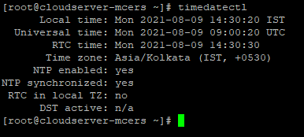

NTP Server Configuration

To Check The Date- Time Settings of Linux Machine

This Command is Used to list the Timezones

This Command is Used to set Required time zones

“chrony” Package is Used To install NTP server

NTP is a Network is time protocol which is Used to set the time of Linux machine according to

Network time 

After installing the chrony package

Add the server details in /etc/chrony.conf  file

This command is used to set ntp server start

Thank You!
