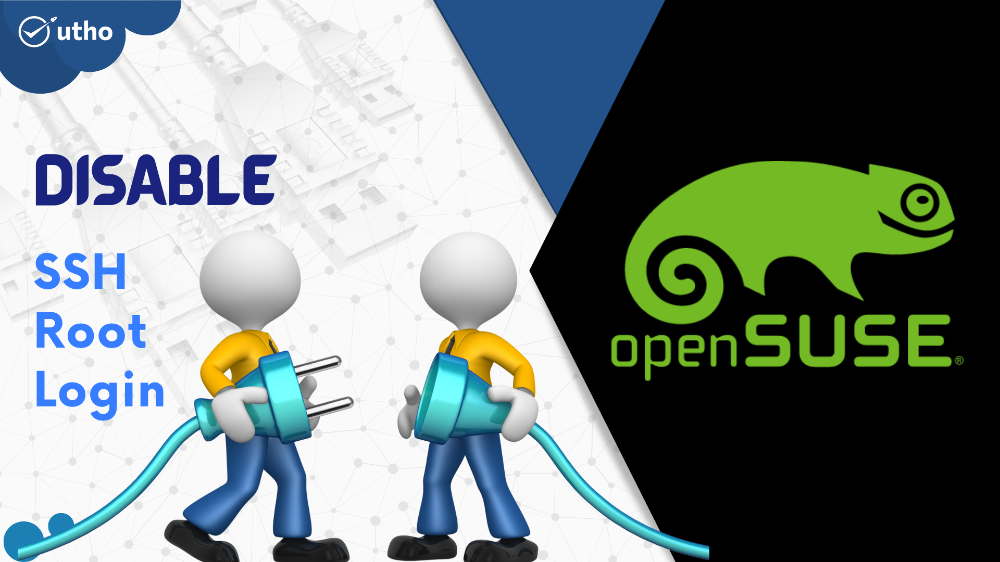
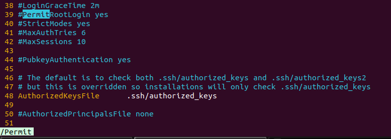

<figure>



<figcaption>

Disable the SSH root login in OpenSUSE

</figcaption>

</figure>

In this article, we will learn how to disable SSH Root login in OpenSUSE server. Today, everyone knows that [Linux computers](https://www.google.com/url?sa=t&rct=j&q=&esrc=s&source=web&cd=&cad=rja&uact=8&ved=2ahUKEwj_17O3pr3_AhVFSGwGHZpAAZsQFnoECBwQAQ&url=https%3A%2F%2Fwww.linux.org%2F&usg=AOvVaw0OoiTmQ34Do398976duTL0) come with root user access, and that by default, the outside world can use root access. For protection, it's not a good idea to let people who shouldn't have it use ssh root access. Any hacker can try to guess your password and get into your system this way.

So, it's better to have another account that you use often and then use the 'su –' command to switch to root user when you need to. Before we start, make sure you have a regular user account. With that, you can use [su or sudo to get root access.](https://utho.com/docs/tutorial/how-to-add-user-to-sudoers-or-sudo-group-in-centos-7-support-internal/) In Linux, it's easy to make a different account. Just log in as the root user and run the 'adduser' command to make a new user. Follow the steps below to stop root from logging in via SSH once the user has been made.

## Prerequisites

- vim, vi or any other text editor installed on machine

- Super user or any normal user with root user privileges.

## Steps to disable the SSH Root login

Step 1: To disable root login, open the main ssh configuration file /etc/ssh/sshd\_config with your choice of editor.

```
vi /etc/ssh/sshd_config
```
Step 2: Find the keywork- "PermitRootLogin" and identify the line as shown in below screenshot.

<figure>



<figcaption>

Search the keywork PermitRootLogin

</figcaption>

</figure>

Step 3: Now, add one entry in next line which disable the ssh root login on your machine.

```
PermitRootLogin no
```
<figure>


<figcaption>

Disable the SSH Root Login in Configuration file

</figcaption>

</figure>

Step 4: To reflect the changes, restart the ssh service of your server.

```
systemctl restart sshd
```
Now need to check the server with new ssh connection, that actually root access is working or not. And this is how you have learnt how to disable SSH Root login in OpenSUSE server.
