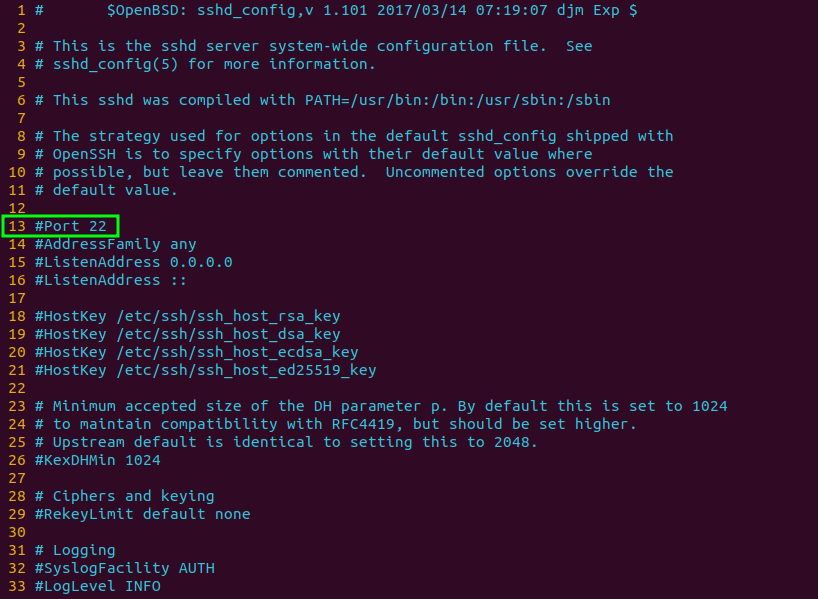
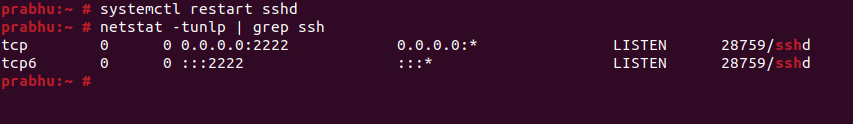

<figure>


<figcaption>

How to change SSH default port on OpenSUSE

</figcaption>

</figure>

In this article, you will learn how to change SSH default port on OpenSUSE. [A network protocol](https://www.google.com/url?sa=t&rct=j&q=&esrc=s&source=web&cd=&cad=rja&uact=8&ved=2ahUKEwjltZOHpL3_AhU7UGwGHWAOA4EQFnoECCcQAQ&url=https%3A%2F%2Fwww.cloudflare.com%2Flearning%2Fnetwork-layer%2Fwhat-is-a-protocol%2F&usg=AOvVaw3iyS_Vfw5RuwPvKqhWb2RY) called Secure Shell (SSH) enables remote server access for users. Additionally, it secures communication between a client and private server by encrypting it.

Nevertheless, utilising the default Transmission Control Protocol (TCP) port 22 for SSH might be dangerous since it is exposed to a number of online dangers, including brute-force assaults, a hacking technique used to obtain encrypted sensitive data.

Therefore, one of the greatest methods to safeguard your SSH server is to change your default port.

## Prerequisites

- vim, vi or any other text editor installed on server to modify config files

- Super user or SUDO user privileges.

## Steps to change the default port of SSH

Step 1: Open SSH configuration file using below command in your favorite editor.

```
vim /etc/ssh/sshd_config
```
<figure>



<figcaption>

Content of SSH configuration file

</figcaption>

</figure>

Now, on line number 13, you can see that the line is commented. to set a custom port for ssh service to listen on, follow the below step.

Step 2: Add "Port 2222" in the next line then save and exit the file.

<figure>


<figcaption>

Add the custom port in configuration file

</figcaption>

</figure>

Note:: This process is done when the SeLinux policy was in disabled mode. If you are using Enforce SeLinux policy, you need to follow the [Step 7 of this article](https://utho.com/docs/tutorial/how-to-change-ssh-port-when-selinux-policy-is-enabled/)

Step 3: Restart ssh service using below command

```
systemctl restart sshd
```
Step 4: Now, to ensure that you ssh server is listening on your custom defined port, use netstat commad.

```
netstat -tunlp
```
<figure>



<figcaption>

Ensure to check the custom ssh port

</figcaption>

</figure>

Step 5: Enable the port in OS firewall

```
firewall-cmd --permanent --add-port=2222/tcp
firewall-cmd --reload
```
Now, you have successfully learnt how to change SSH default port on OpenSUSE.
