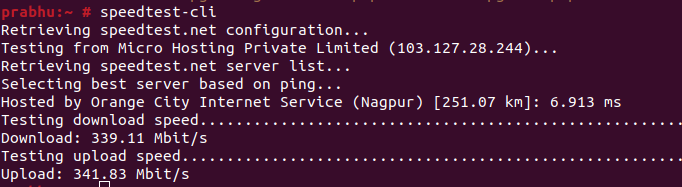

<figure>


<figcaption>

How to check the internet speed on OpenSUSE

</figcaption>

</figure>

In this article, you will learn how to check the internet speed on OpenSUSE. It is not unusual for users to inquire about the bandwidth of their Internet connection. When using the desktop version of the [operating systems](https://en.wikipedia.org/wiki/Ubuntu)[,](https://utho.com/docs/tutorial/how-to-install-netstat-on-ubuntu-20-04-lts/) all you have to do to check the speed is type the relevant query into a search engine and observe how long it takes for the results to load on any of the websites that come up in the search. This is the only thing you need to do in order to check the speed. In contrast to this, the process will be different while utilising the server-based alternative. You will learn how to check the speed of your connection using [Ubuntu 20.04](https://utho.com/docs/tutorial/how-to-install-git-on-ubuntu-20-04/) by following the steps in this guide. When typing commands, it is imperative that one always do it as the root user.

ISPs have reported seeing traffic loads that are greater than they have ever been due to an increase in the number of individuals staying at home and spending more time on the internet. If you have observed that your network speed has slowed down at certain periods, the cause is likely a worldwide overflow.

## Prerequisites

- Normal user with SUDO privileges or Super user

- Zypper repolist enabled to install packages

## Steps to test internet speed test on OpenSUSE

Step 1: First check whether python is installed on your machine or not.

```
python --version
```
Step 2: Install python-pip to install speedtest command line interface to test the internet on your OpenSUSE server.

```
zypper install python-pip
```
<figure>


<figcaption>

install python-pip

</figcaption>

</figure>

Step 3: Now, after successfully installing the python-pip on your machine, install the speedtest-cli command line interface on your server.

```
pip install speedtest-cli
```
<figure>


<figcaption>

install Speedtest

</figcaption>

</figure>

Step 4: Check the internet speed test on your server using the newly install command line interface.

```
speedtest-cli
```
<figure>



<figcaption>

Acutal speed test

</figcaption>

</figure>
