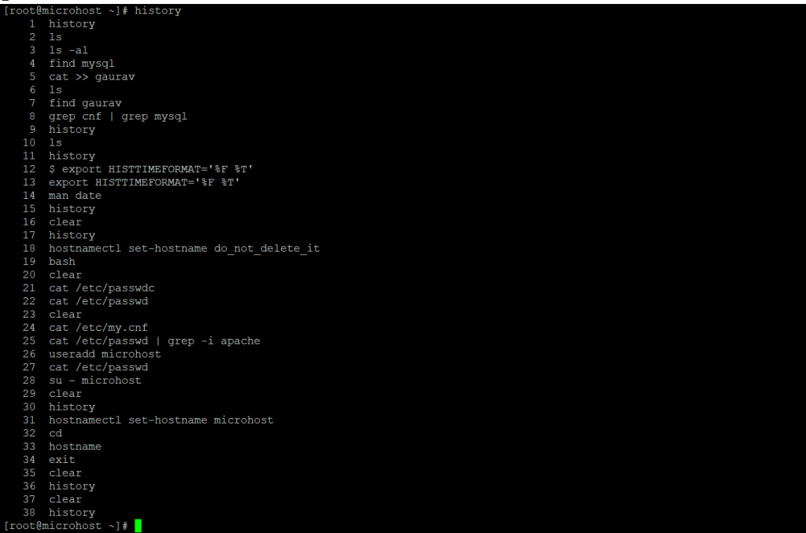

**Description**

By default, all commands executed on the command line by Bash are saved in the history buffer or recorded in a file called /.bash history. This means that a system administrator can view a list of commands executed by users on the system, or a user can check his/her command history using the history command.

```
history
```


The date and time when a command was executed are not displayed in the output of the history command above. This is the default setting on most, if not all, Linux distributions.

This article will describe how to specify time stamp information about when each command in the Bash history was executed to be displayed.

By setting the HISTTIMEFORMAT variable, the date and time associated with each history entry can be recorded to the history file, denoted with the history remark character.

There are two ways to do this: one is temporary, and the other is permanent.

To set **HISTIMEFORMAT** variable temporarily, export it as below on the command line:

```
export HISTTIMEFORMAT='%F %T'
```
The time stamp format in the export command above is:

`**%F**` – same, as **%Y-%m-%d** (year-month-date).

**`%T`** – same as **%H:%M:%S** (hour:minute:seconds).

For more information on how to use the date command, see the man page:

```
man date
```
Then, as follows, review your command history:

```
history
```


If you want to permanently configure this variable, open the file /.bashrc with your favourite editor:

```
vi .bashrc
```
And insert the following line (marked with a comment as your own configuration):

```
#my config
export HISTTIMEFORMAT='%F %T'
```

After saving the file and exiting, run the command below to apply the modifications to the file:

```
source .bashrc
```
That's all! Please share any noteworthy history command tips and techniques, as well as your views on this article, in the comment area below.

**ThankYou**
