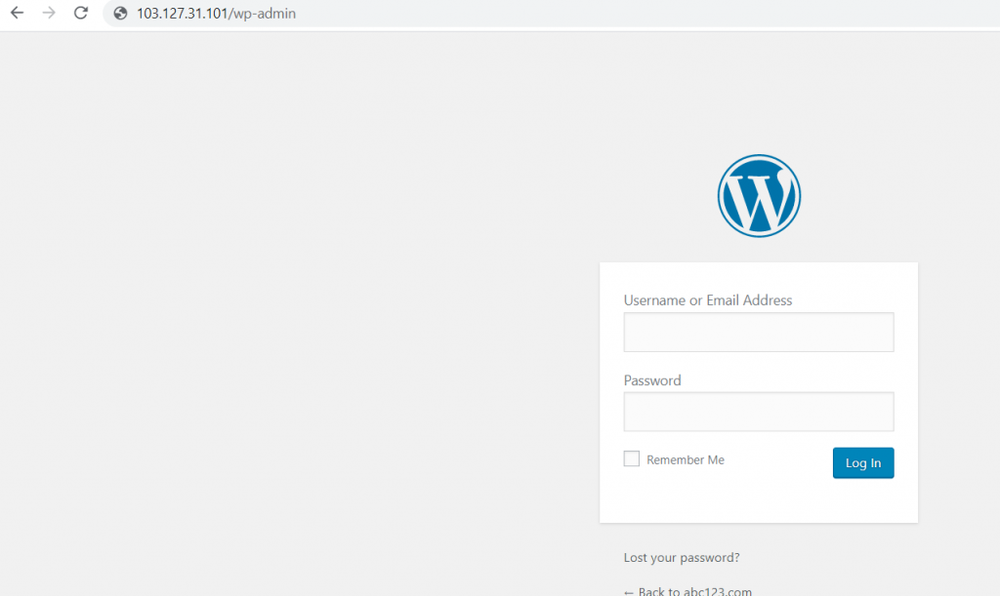
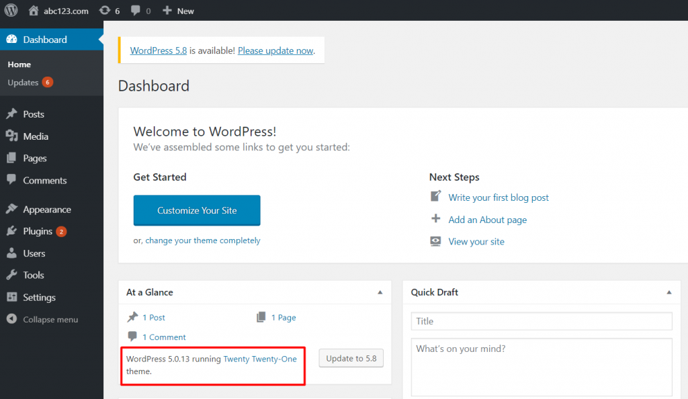

Step 1. login to wordpress by accessing the server IP\_address/wp-admin or domain\_name/wp-admin in the browser.

Step 2. check the current version of wordpress , i.e 5.0.13 here.

Step 3. Download the most recent version of WordPress from the official WordPress website to your local machine.

Please visit [https://wordpress.org/download/releases/](https://wordpress.org/download/releases/) for more information.

Step 4. extract the zip file and then connect the server using FileZilla.

NOTE : hostname : serve\_ip , username , password , port : 22. 
As shown in the below screenshot.

Step 5. Navigate to your website's root directory (for example, /var/www/html/wordpress) on the server side and delete the ‘wp-admin' and ‘wp-includes' directories.

Step 6. Now, Copy the ‘wp-includes’ and ‘wp-includes’ directories from the unzipped new version WordPress to the website root directory(which replaces the directories deleted in step 5 at website root directory).

Step 7 : Do not delete any files or directories in the website's root directory after step 6. In this section just copy all of the files from the new version WordPress directory to the existing ‘wordpress' website root directory (by this act it overwrite the existing files with same name).

Step 8. Your wp-config.php file will be unaffected because the default config file for WordPress will be wp-config-sample.php. Examine wp-config-sample.php for any changes to the wp-config.php file. You can also edit database records & rename the wp-config-sample.php file as wp-config.php ,afterwards just delete the older file(wp-config.php).

Step 9. Now, from your browser, navigate to the WordPress admin page at ‘ip address (or)domain name/wp-admin' and update the WordPress database.

Step 10. Login into the wordpress and check the current version of wordpress .

Wordpress has been updated.

Thank you!!
