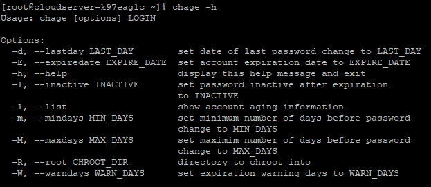

## Introduction

## **In this article, you will learn how to use 'chage' command in Linux.**

Password expiration information can be viewed and updated with the chage command. This command is used when a user's login is only going to be active for a short period of time, or if the user needs to have their password changed periodically. An account's age, the time and date of its last [password](https://en.wikipedia.org/wiki/Password) change, the time at which the account will be locked, and other similar details can all be viewed with the help of this command.

The help option can be used to see a complete list of the chage\[change\] command's options.

```
#chage -h
```



If you want to see how old your accounts are (the -l option), you can do that. I'm using sudo to see the root's age information. Enter :# sudo chage -l root

```
#sudo chage -l root
```


The second option, -d, allows you to change the last password to a date in the past that you specify in the command. By using the "sudo" prefix, I am able to alter the root's age data. In addition, I'm checking the modified date with the -l option. Copy and paste this command into the box: sudo change -d 2022-05-05 root

```
#chage -d 2022-05-5 root
```  
```
#chage -l root
```


By selecting the -E option, you can set the account's expiration date. I'm using the command sudo to update the root user's age. In addition, I'm checking the modified date with the -l option. Type: sudo change -E root

```
#chage -E 2022-10-10 root
```  
```
#chage -l root
```


The -M or -m option lets you set the maximum and minimum intervals between password changes. I'm using the command sudo to update the root user's age. Additionally, I am checking out the new time frame with the -l option. Key in: sudo change -M 5 root

```
#chage -M 5 root
```

```
#chage -l root
```


The -I switch allows you to set the inactivity period for your account after it has expired. If the user doesn't log in after the password has expired, this command will prompt them to change it. If the password isn't changed after this time, the account will be locked and the user will need to contact the administrator to have it unlocked. I'm using the command sudo to update the root user's age. Additionally, I viewed the idle time by using the -l option. Copy and paste: sudo change -I 5 root

```
#chage -I 5 root
```  
```
#chage -l root
```


Password expiration notices can be issued in advance with the help of the -W option. The command takes a number representing the number of days before the expiration date as its input. I'm using the command sudo to update the root user's age. To see the caution period, I am using the -l option. Just type: sudo change -W 2 root

```
#chage -W 2 root
```  
```
#chage -l root
```

## Conclusion

Hopefully, you have learned how to use 'chage' command in Linux.

Also read: [How to prevent a user from login in Linux](https://utho.com/docs/tutorial/how-to-prevent-a-user-from-login-in-linux/)

Thank You 🙂
