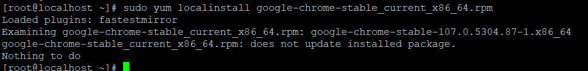
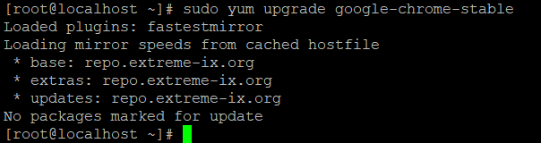

**Description**

One of the most widely used web browsers now available is Google Chrome. It has a market share of over 62% and offers far higher levels of both security and performance compared to any other browser. On the other hand, it is not completely open source and instead built on top of the open source Chromium project. Using the yum command, this tutorial will walk you through the process of installing the stable version of Google Chrome on CentOS 7.

The following steps should be taken in order to install the application on your desktop running CentOS Linux:

## download Google Chrome

```
# wget https://dl.google.com/linux/direct/google-chrome-stable_current_x86_64.rpm 
```

## yum command to install Chrome web browser

```
# sudo yum localinstall google-chrome-stable_current_x86_64.rpm 
```

## update Chrome

```
# sudo yum upgrade google-chrome-stable 
```

## CentOS 7 install Google Chrome

```
# wget https://dl.google.com/linux/direct/google-chrome-stable_current_x86_64.rpm 
```


## Chrome installation on CentOS 7 desktop

```
# sudo yum localinstall google-chrome-stable_current_x86_64.rpm 
```

Check out the screenshot below to see whether it's already installed….



Your computer now has the Google Chrome web browser installed. And that is it.

## How do I launch stable Google Chrome?

At the prompt given by your shell, simply type the following command:

```
# google-chrome & 
```

Alternately, you can begin the process from within the GUI itself:

Applications > Internet > Google Chrome


It should look something like this when you use Google Chrome:


## How can I update Chrome on my CentOS 7 computer?

To update Google Chrome, simply use the yum command as detailed below:

```
# sudo yum update 
```

or

```
# sudo yum upgrade google-chrome-stable 
```



Find out more about the yum command.

```
# man yum 
```

Conclusion

On this page, installation instructions for Google's browser on a CentOS 7 workstation were provided. To learn more, have a look at the official Google Chrome website right here.

**Thank You**
