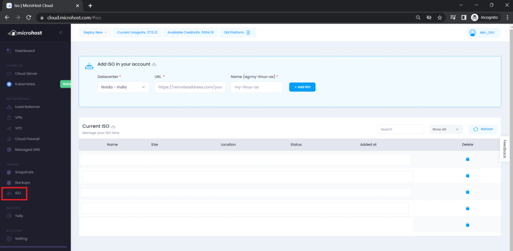
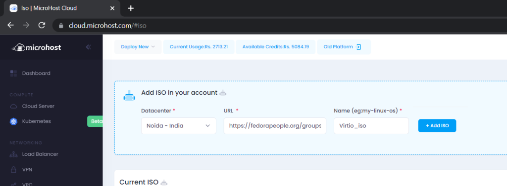
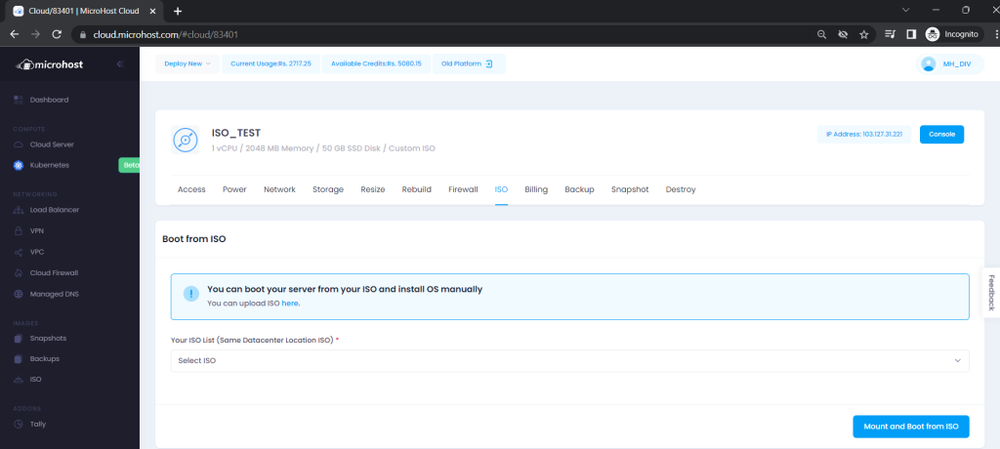
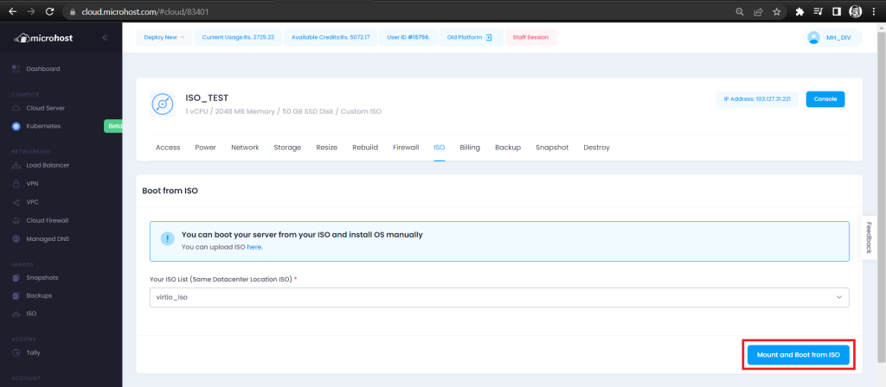
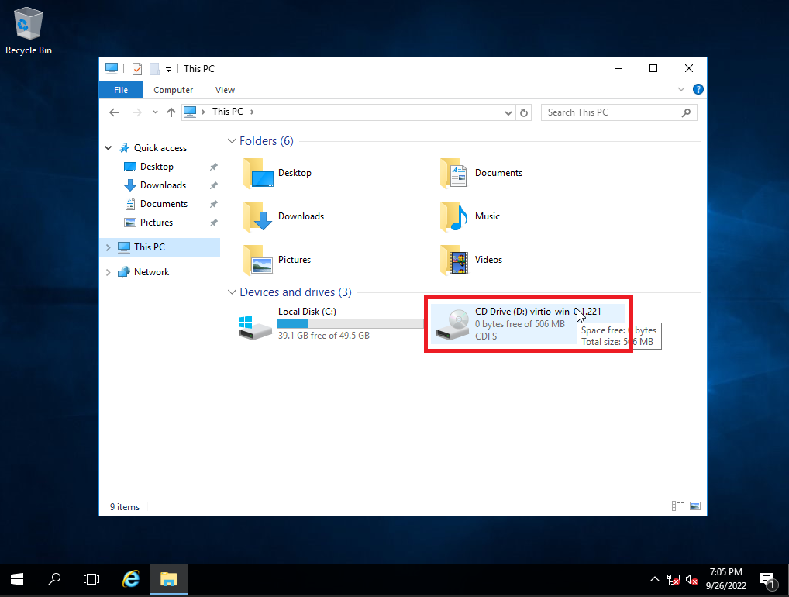
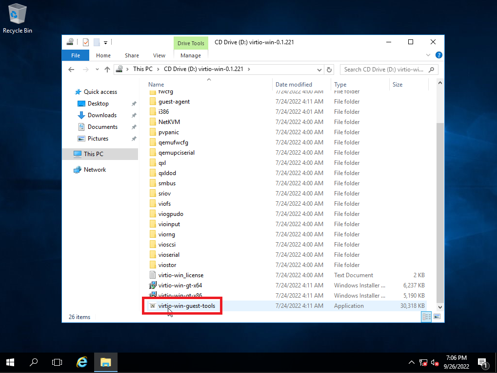
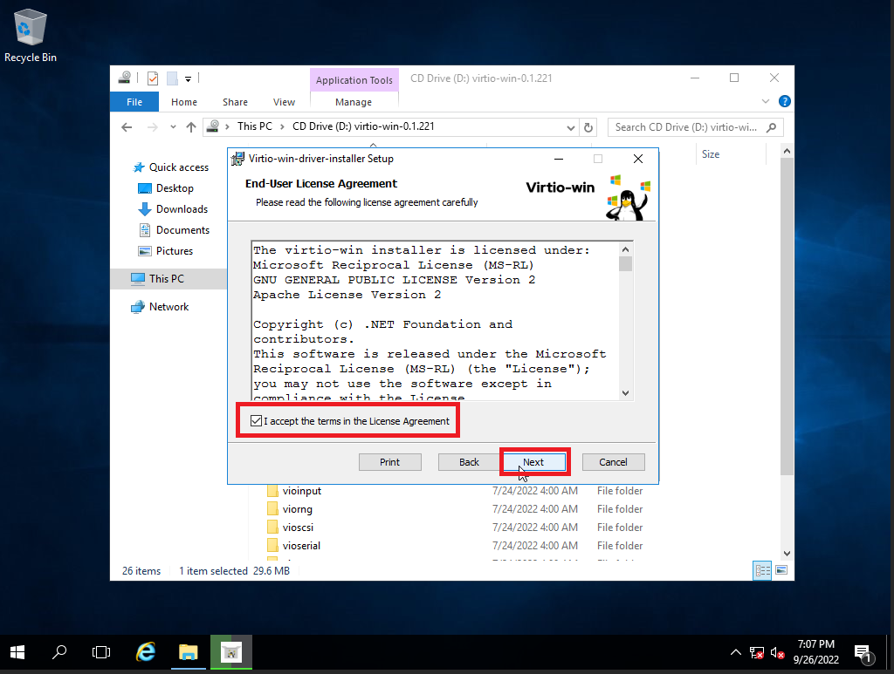
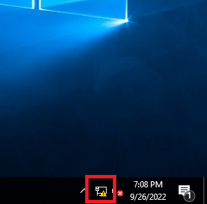

Step 1. After installing OS using custom ISO, login to Microhost.com and go to ISO section.

Step 2. Upload Virtio Network Adapter ISO

LINK: [Virtio Win ISO](https://github.com/virtio-win/virtio-win-pkg-scripts/blob/master/README.md)

Step 3. Check if the ISO is downloaded properly.

Step 4. Go to Mnage Cloud and Click on ISO sub-section

Step 5. Select Virtio ISO and click on "Mount and Boot from ISO"

Step 6. After the ISO is mounted and server is booted from the ISO, go to **Console** and open **This PC** > Open Virtio Driver

Step 7. Double click on "virtio-win-guest-tools"

Step 8. Proceed with the installation process as follows:

Network Driver installed once you see the following icon.

Now follow the below mentioned document to configure IP manually on windows Server.

URL: [How to configure IP manually on Windows Server.](https://utho.com/docs/tutorial/how-to-configure-ip-manually-on-windows-server/)

Thank You.
