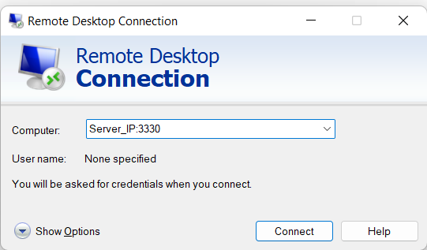
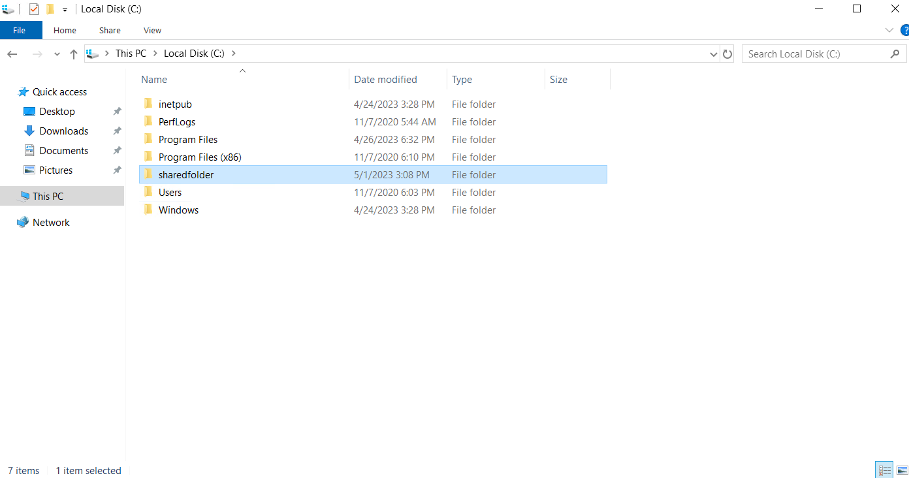
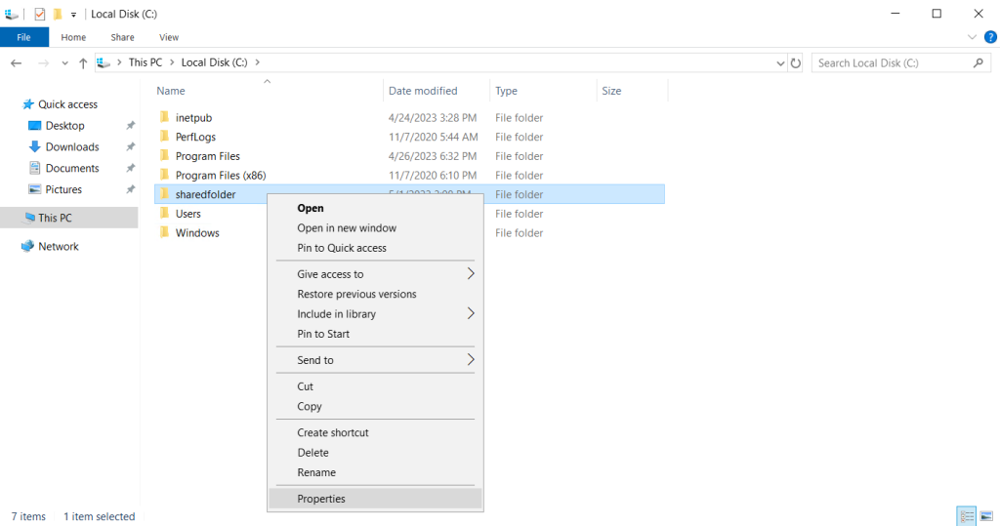
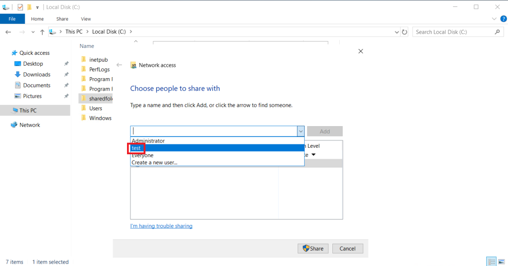
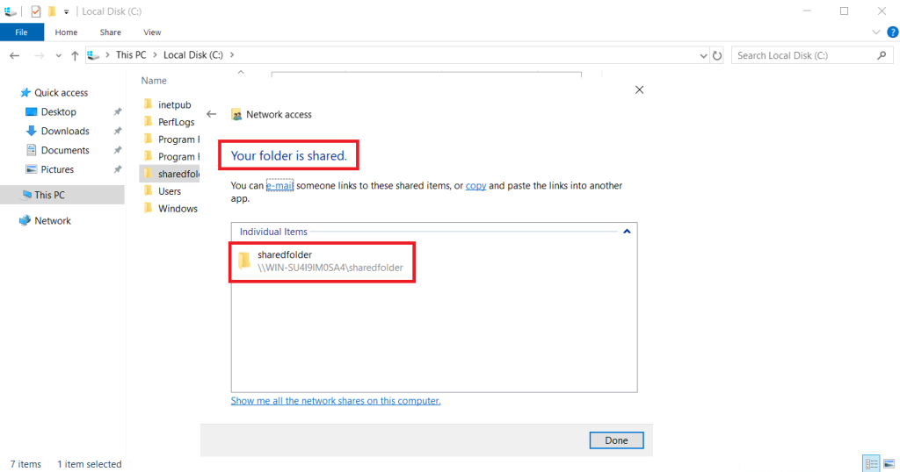
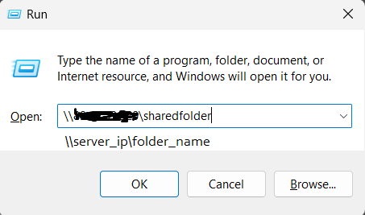
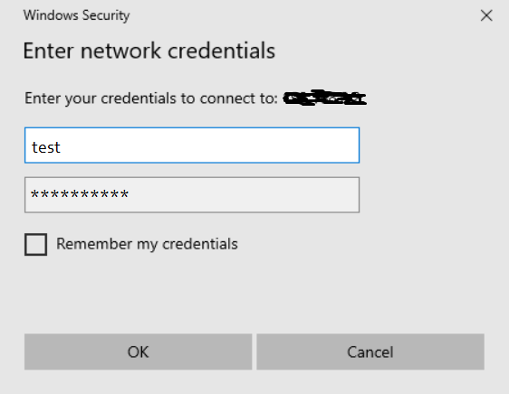
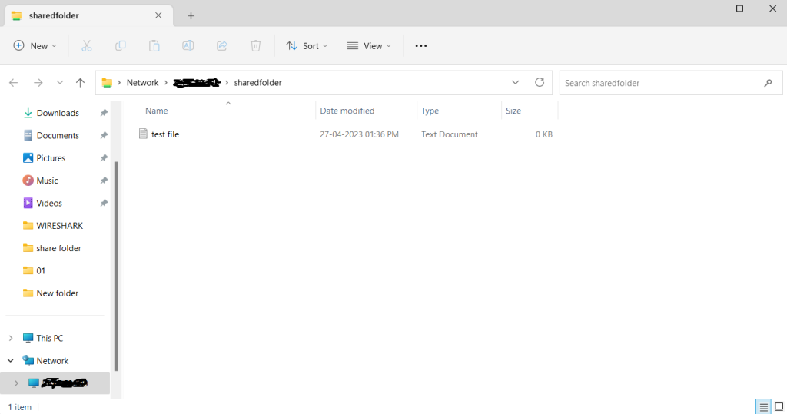

#### INTRODUCTION

In this tutorial, we will learn how to share a folder over network in Windows Servers. There are many ways to setup shared folder in **[Windows Server](https://www.microsoft.com/en-us/evalcenter/evaluate-windows-server-2022)**. You can use Server Manager to share a folder. We can also use folder properties share option to share a folder. In this tutorial, we will learn the steps to share a folder in Windows Server 2016 using folder properties share option.

##### Prerequisites share a folder over network

1. [Windows Server](https://utho.com/docs/tutorial/how-to-reset-a-lost-administrator-password-in-windows-server/)
2. Internet connectivity

**NOTE:** We recommend you use a user other than Administrator for file sharing. We will be using a test user.

Step 1. Connect to your Windows server via RDP.

Step 2. Create/select a folder that you wish to share.

Step 3. Right-click on the folder and go to **properties**

Step 4. Go to **sharing** tab and click on **Share...**

Step 5. Now we will give folder access to the user we wish to access the folder with. In our, it's the test user that we are using to share the folder.

Step 6. Now we will give access to the user so that it can read or write the contents of the folder.

Step 7. The folder has been shared. share a folder over network

Step 8. Now we will access the folder remotely using the servers IP address. We will input the folder path as \\\\server\_ip\\folder\_name

Step 9. The connection will prompt to provider username and password to access the folder. In our case, we will be using the credentials of the test user.

Step 10. We have successfully accessed the shared folder.

Thank You.
