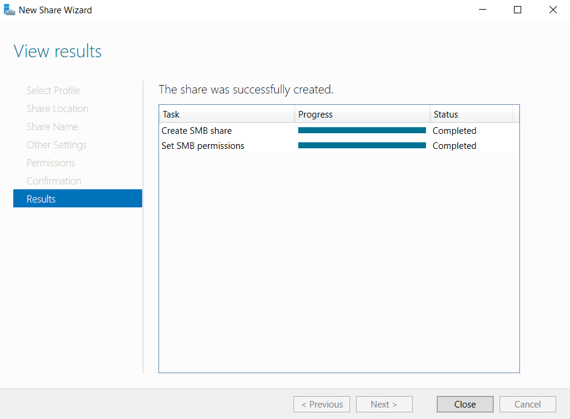
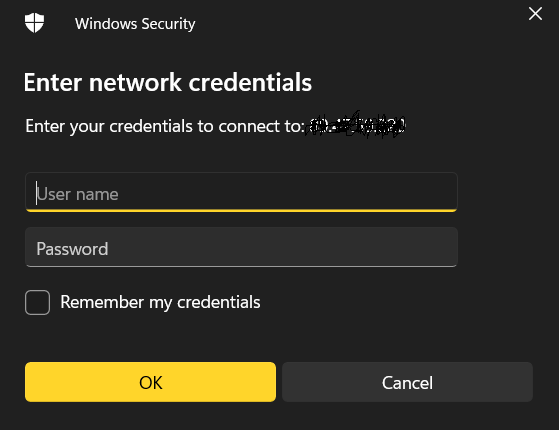

#### INTRODUCTION

In this tutorial, we will learn how to share a folder over network using Server Manager in Windows Servers. There are many ways to setup shared folder in **[Windows Server](https://www.microsoft.com/en-us/evalcenter/evaluate-windows-server-2022)**. You can use folder properties share option to share a folder. In this tutorial, we will learn the steps to share a folder in Windows Server 2016 using Server Manager folder share option.

##### Prerequisites

1. [Windows Server](https://utho.com/docs/tutorial/how-to-reset-a-lost-administrator-password-in-windows-server/)
2. Internet connectivity

Step 1. Connect to your Windows server via **RDP**.

Step 2. Go to Server Manager.

Step 3. Go to **File and Storage Services**.

Step 4. Click on TASKS and Click on "**New Share**"

Step 5. Select **SMB Share - Quick**

Step 6. Select the folder via it's path that you wish to share

Step 7. Give the folder appropriate permissions as per your requirements.

Step 8. Click close once the share is completed.

Step 9. Connect to the folder using network path using login credentials of RDP user

Folder aceessed.

Thank You!
