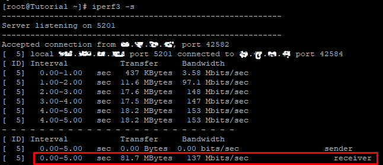
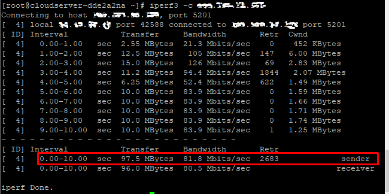

## Introduction

In this article, you will learn how to use iperf to test network performance.

[iperf](https://en.wikipedia.org/wiki/Iperf)3 is a free, open-source, command-line based tool that works across multiple platforms and is capable of providing real-time network throughput measurements. It is one of the effective instruments for measuring the maximum bandwidth that can be supported by IP networks (supports IPv4 and IPv6).

You will need to improve both the throughput and the latency of your network's receiving and sending capabilities in order to achieve maximum, or at least improved, network performance. This can be accomplished by increasing the throughput of your network's receiving capabilities. However, before you can begin the real tuning process, you need to run several tests to collect statistics on the overall performance of the network. These statistics will serve as a roadmap for the tuning procedure.

Its results include the time interval in seconds, the amount of data transferred, the bandwidth (transfer rate), and loss, in addition to other helpful network performance indicators. This is the primary purpose of the tool, which is to assist in adjusting [TCP connections](https://utho.com/docs/tutorial/how-to-troubleshoot-with-nmap-in-centos/) across a certain path, and it is on this topic that we will concentrate our attention in this article.

## Requirements:

Two networked PCs with the iperf3 application installed.

```
# apt install iperf3 -y (Debian/Ubuntu)

```

```
# yum install iperf3 -y (RHEL/CentOS)

```

```
# dnf install iperf3 -y (Fedora 22+)

```

In order to assess the throughput of a network between two computers, iperf makes use of the concepts of a "client" and a "host."

#### Host:

On the host system, the iperf application is told to wait for a connection from a client:

```
# iperf3 -s

```


Here,

\-s Allows you to listen in the server role

#### Client:

Establish a connection to the first on your client. Change the value of (server ip) to the host's IP address.

```
# iperf3 -c (server ip)

```


Here,

\-c: Connect to a server that is listening at…

## Test Results

After the test has been completed, both the client and the host will submit their outcomes:

### Host



As you can see in the above screenshot, within a time interval of one second 437 KBytes of data is being transferred at a bandwidth of 3.58 Mbits/sec and so on.

As a result, total of 81.7 MBytes of data is being transferred at a bandwidth of 137 Mbits/sec within a time interval of five seconds.

### Client



In iperf3, the column **Retr**, which stands for "**Retransmitted** TCP packets," shows how many TCP packets had to be sent again. The value in Retr should be as low as possible. The best value would be 0, which means that no matter how many TCP packets have been sent, not a single one needs to be sent again.

One of the things that determines how many bytes can be sent out at any given time is the congestion window (CWND). The sender controls the congestion window, which keeps the link between the sender and the receiver from getting too busy with too much traffic.

## Conclusion

Hopefully, you have learned how to use iperf to test network performance.

Thank You 🙂
