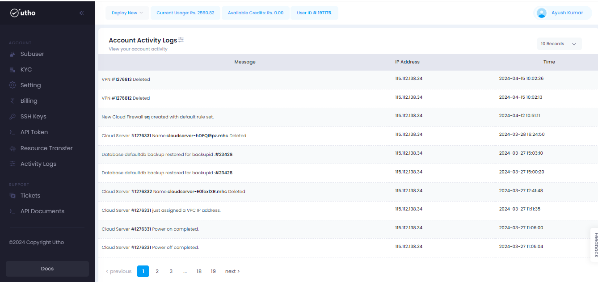
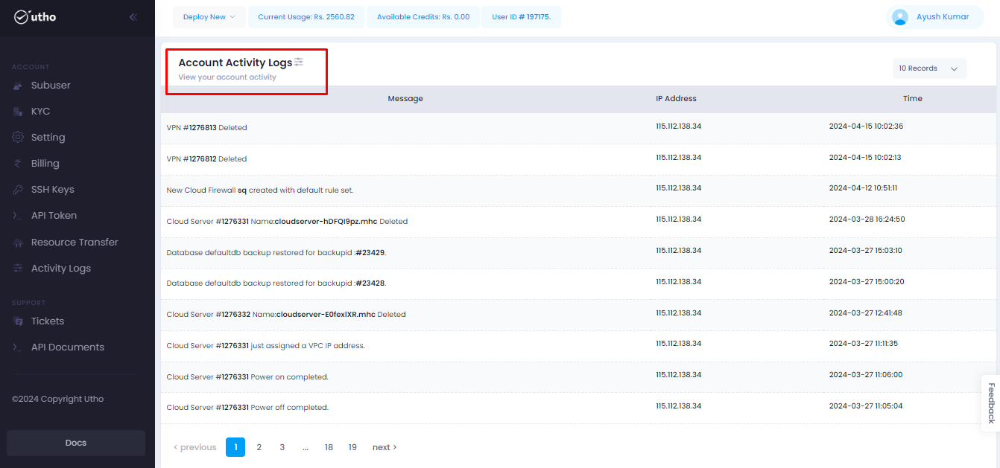

# Activity Logs
---
Activity logs in the cloud refer to detailed records of actions and events that occur within a cloud environment. These logs capture activities such as resource provisioning, configuration changes, access attempts, and administrative actions. Activity logs are essential for auditing, compliance, troubleshooting, and security purposes.
Activity logs in the cloud are essential for maintaining visibility, compliance, and security posture within your cloud environment. They enable organizations to monitor and analyze activities, detect unauthorized access, and respond to incidents effectively.

### Activity Logs offer several benefits:
- Detect unauthorized access
- Security
- Compliance
- Maintaining visibility
- Incremental Activity Logs

### Steps for approaching the Activity Logs:
---
#### Visit on the link given below:
>
[Console url](https://console.utho.com/)
1. This link will redirect you to the Dashboard after Login of the platform.  

 

2. On L.H.S user will get an option of Activity Logs when scrolling down as shown in the snippet below.

3. After that, a new page will open where the user will get all the details of the activities that have happened in their profile.

4. Now on the homepage of Activity Logs user will get option for restoring and deleteing the Activity Logsshot as given in the snippet.

---
**THE END**
