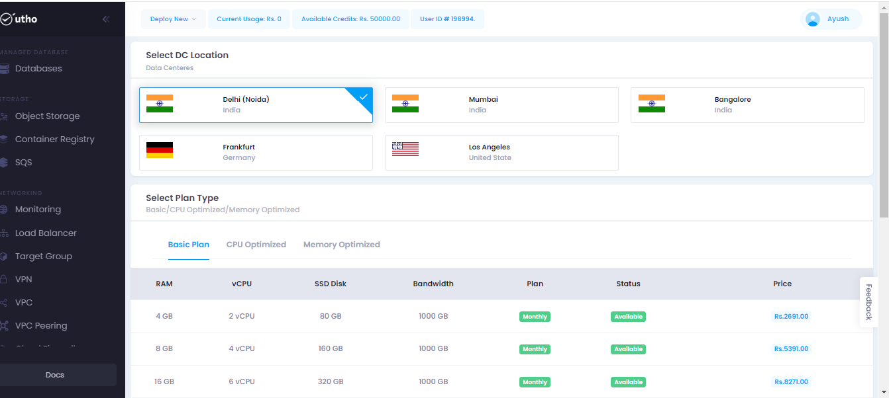
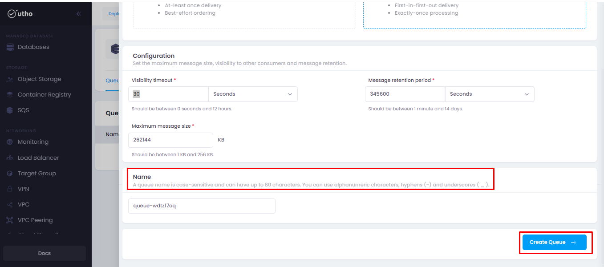

# SQS (Simple Queue Service)
--- 
Simple Queue Service allows you to decouple and scale microservices, distributed systems, and serverless applications by providing a reliable and highly scalable messaging system.SQS supports both standard and FIFO (First-In-First-Out) queues, allowing you to choose the message ordering and delivery behavior that fits your use case.
Overall, **UTHO** SQS is a reliable and scalable messaging service that helps you build loosely coupled, distributed systems in the cloud. It's commonly used for asynchronous communication between microservices, decoupling components of a system, and managing workloads in serverless architectures.

### SQS offer several benefits:

-   Cost-effectiveness
-   Fully Managed
-   Reliable
-   Scalability
-   Simple
-   Flexible

### Steps for approaching the SQS:
---
#### Visit on the link given below:
>
[Console url](https://console.utho.com/)
1. This link will redirect you to the Dashboard after Login of the platform.

2. Here on L.H.S sidebar user will get an option for SQS as marked in the snippet below.

3. On clicking it will redirect user to the homepage of SQS.

4. Here user can create new SQS by clicking on create SQS button marked in the attached snippet.

5. On clicking it will redirect user to the deploy page.

6. Here user will select the Data Center location from the given options.

7. Now user will select the Plan Type according to their consumption.

8. Now user can give the name for there SQS if not given then it will generate automatically and then click on create SQS button as shown in the snippet below.

9. After clicking on create SQS deployment of SQS will be done and it will redirect user to the homepage of SQS. Where on clicking on manage SQS a new tab will occur.

10. Then user will get the option to create the queue by clicking on the create queue button.

11. On clicking on it a sidebar will open , here the process of Adding a new queue will start.

12. Now user will select the queue type for there application.

13. Now user will set the configuration like message size, visibility to other consumers and message retention.

14. Then user will give a proper name for there queue and click on create queue.

15. After clicking it will redirect user to the homepage of queue.

16. Here user will get the option for sending message by clicing on send message tab as shown in the snippet below.

17. Here user can send the message from there queue by clicking on send message button.

18. Now on clicking on delete icon the created queue will be deleted.

---
**THE END**

