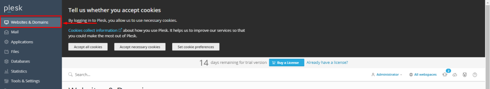

## Introduction

In this article, you will learn how to change PHP parameter manually through [Plesk](https://en.wikipedia.org/wiki/Plesk).

Step 1. Log into your Plesk with your server password by searching server\_ip:8880 in your browser.

Step 2. select website and domains 

Step 3. Select [PHP](https://utho.com/docs/tutorial/how-to-change-the-php-version-on-plesk/) settings. 

Step 4. Change the default setting beneath the Performance and Security settings to your liking. 

Step 5. Scroll down the page and press the "apply" button to save the changes.

Step 6. And then you will get a success message.

## Conclusion

Hopefully, now you have learned how to change PHP parameter manually through Plesk.

Thank You 🙂
