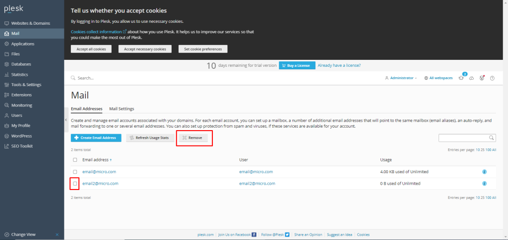

## Introduction

In this article, you will learn how to delete an Email account in [Plesk](https://en.wikipedia.org/wiki/Plesk).

Step 1. Enter your server password to get into your Plesk account, which can be found by searching your browser for server ip:8880.

Step 2. To see a list of the email accounts you have access to in your panel, choose Mail from the menu on the left side of the screen.

Step 3. Select the email account or accounts that you want to delete by checking the box next to them and clicking the button marked "remove.".

Step 4. After that, choose "yes, delete" from the menu. The deletion of an email account on Plesk is completed in this manner.

Step 5. You should immediately get a message congratulating you on your success.

## Conclusion

Hopefully, now you have learned how to delete an Email account in Plesk.

Also Read: [How to assign permissions to Files and Folders in Plesk](https://utho.com/docs/tutorial/how-to-assign-permissions-to-files-and-folders-in-plesk/)

Thank You 🙂
