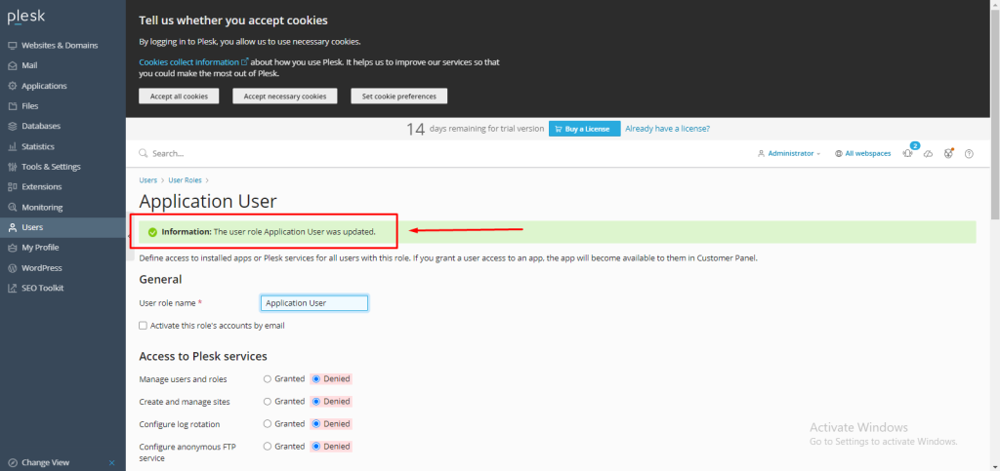

## Introduction

In this article, you will learn how to manage user roles in [Plesk](https://en.wikipedia.org/wiki/Plesk).

Step 1. Log into your Plesk with your server password by searching server\_ip:8880 in your browser.

Step 2. Choose user from the menu on the left side of the screen. 

Step 3. Click on user roles.

Step 4. Select any role name for whom you want to manage their roles.

Step 5. Then select the user's [permissions](https://utho.com/docs/tutorial/how-to-assign-permissions-to-files-and-folders-in-plesk/) based on your preferences and click on apply.

Step 6. And then you will get a success message.

## Conclusion

Hopefully, now you have learned how to manage user roles in Plesk.

Thank You 🙂
