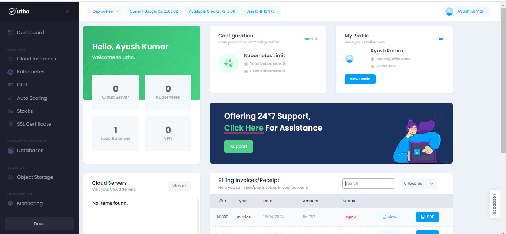
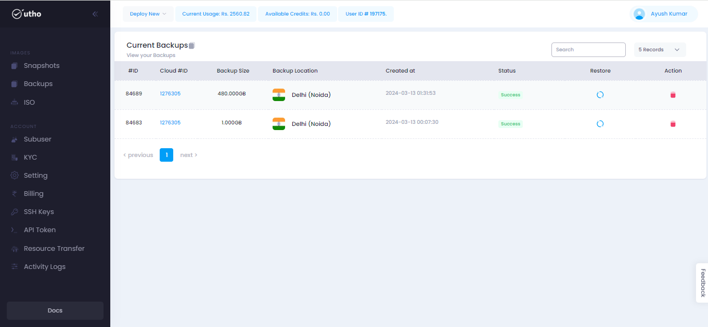

# Backups
--- 
Backups in the cloud involve creating and maintaining copies of your data, applications, or entire systems in a remote cloud-based environment. Cloud backup solutions offer several advantages over traditional on-premises backup methods, including scalability, cost-effectiveness, and ease of management.

### Backups offer several benefits:
- Disaster Recovery
- Integration with Backup Software
- Cross-Region Replication
- Backupsshot-Based Backups
- Incremental Backups
- Automated Backup Policies
- Data Backup

### Steps for approaching the Backups :
---
#### Visit on the link given below:
>
[Console url](https://console.utho.com/)
1. This link will redirect you to the Dashboard after Login of the platform. 

 

2. On L.H.S user will get an option of Backups when scrolling down as shown in the snippet below.

3. After that a new page will occur where user will get all the details of the his Backups he took during the process on different products like on Cloud instances we have option of Backups.

4. Now on the homepage of Backups user wil get option for restoring and deleteing the Backups as given in the snippet.

---
**THE END**

