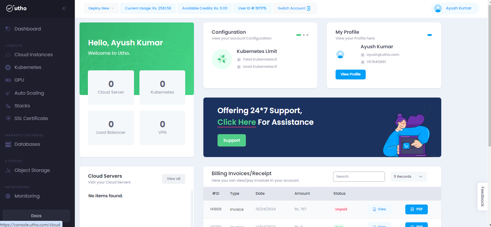
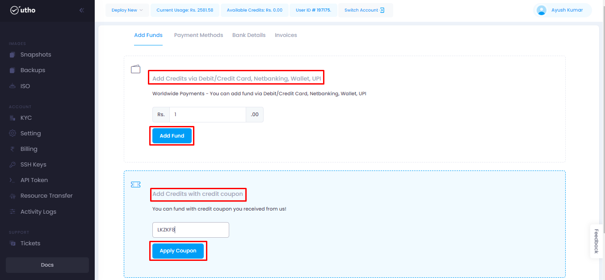
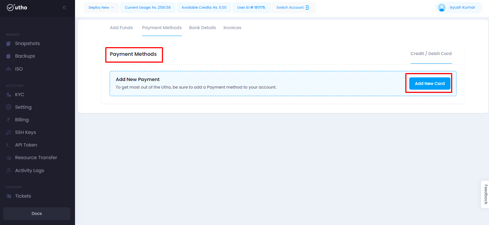
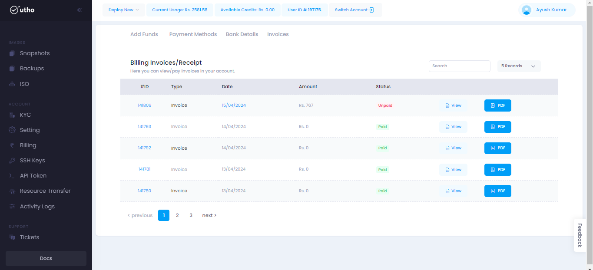

# Billings 
--- 
Billing in the cloud refers to the process of invoicing and charging for the usage of cloud computing services and resources.
Billing in the cloud is a flexible and transparent process that allows customers to pay only for the resources they use, while providing visibility and control over their cloud spending.

### Billings offer several benefits:
- Cost Estimation
- Resource Pricing
- Billing Alerts
- Discounts/Coupon

### Steps for approaching the Billings:
---
#### Visit on the link given below:
>
[Console url](https://console.utho.com/)
1. This link will redirect you to the Dashboard after Login of the platform. 

 

2. Now on the L.H.S when scrolling down user will find an option of billings as shown in the snippet.

3. After clicking on billings it will redirect user on the homepage of billings.

4.  Here in Add Funds tab , there are two options:
- Adding funds using different mode of payments.
- Add credits with credit coupon.

- On clicking on the add funds button user will be able to add credits in his account.
- On the other hand after applying the credit coupon and clicking on apply coupon the funds associated with the coupon will be automatically show in the available credit section.  

5. Now on navigating to Payment methods section,  user will see an option for adding payment methods as shown below in the snippet.

6. After clicking on add new card a tab of razorpay will occur where multiple payment methods are available.
7. And after clicking on the paynow button it will follow the process and the credits added will be shown in Available credit section.

8. Navigating to Invoice section , user can see all the invoices generated.

**NOTE:** On every credit/coupon added user will get the receipt on e-mail too. 

---
**THE END** 
