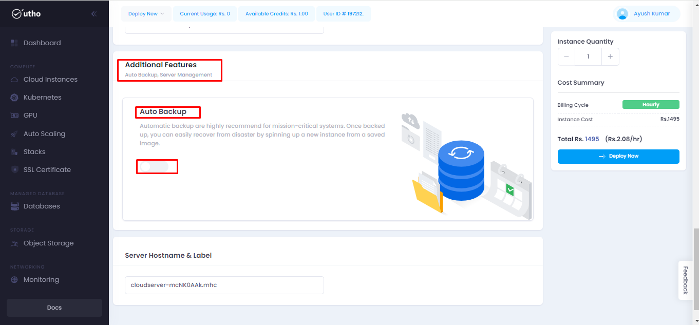

# Cloud Instances
--- 
Cloud instances refer to virtual machines (VMs) or servers that are hosted in a cloud computing environment. Instead of running on physical hardware that's located on-premises, these instances run on servers provided by a cloud service provider.

### Cloud Instances offer several benefits:

-   Scalability
-   Flexibility
-   Accessibility
-   Reliability
-   Pay-as-you-go pricing

### Steps for approaching the Cloud Instances :
---
#### Visit on the link given below:
>

1. This [link](https://console.utho.com/) will redirect you to the Dashboard after Login of the platform. 

 

2. Here you will get 2 options to manage the cloud instances tab.

-   Deploy new (Dropdown)- To deploy a new instance
-   Left side menu tab Cloud instances- To deploy, view or manage the cloud instances.

    

3. After selecting the left menu option it will redirect you to the **cloud instances** homepage.

    

4. Now for creating a new cloud server click on **create cloud server** or  **deploy new**.

    

6. Now from **Select DC location** , select one required location where you want to deploy your server.
    

7. In **select OS/Apps** choose any one from the given options:

-   **Operating System**: Deploy server using available operating system on Utho platforms
-   **Marketplace**: Deploy server using user's private or globally available marketplaces teamplates
-   **Stacks**: Scripts to be executed after server deployment
-   **ISO**: Deploy server with Custom ISOs
-   **Snapshots**: Deploy server with a snapshot of an existing or previosly existing server.
-   **Backups**: Deploy server using the backup of an existing or previously existing server.
 

    **NOTE:** In the marketplace selected apps will be automatically
assigned with the required operating system.

8. Now select the **Required Billing Cycle**:

-   Hourly
-   Weekly
-   Monthly

    On selecting the billing cycle, the calculated price for that billing cycle can be seen in the Instance Quantity tab on the right-hand side
    

9. From the **Select Plan Type** , choose the required plan from (Basic Plan, CPU Optimized, Memory Optimized).

    

10. Now provide a **password** or **ssh key** for your cloud instance , If not provided then it will be auto generated from the backend with a random passcode.

11. If required, choose VPC Network for the server or you create a new VPC by clicking on the highlighted button.

13.  After clicking on Add new VPC , it will redirect you to the page below. 

14. Fill all the required fields and click on Deploy VPC button. Then a new VPC will be created on the cloud instances tab.

15. If any additional features are required like auto backups or server management then click on the toggle button .

    

These add-on services are chargeable, which will affect the overall cost of your server. The pricing details can be viewed in the Instance Quantity tab on the right-hand side.

16. Enter the server's hostname in **Server Hostname & Label**. by default it will be auto generated.

17. Now for deploy , Click on the **Deploy Now** button available in the **Instance Quantity** tab.

    

18.After clicking on 'Deploy', except for hourly billing, a tab for payment will appear. An invoice slide will open upon clicking the 'Pay' button.

19. We will receive the various methods of payments for the product.
 

20. After payment , payment confirmation message will be seen.
 
21. Then it will redirect to the billings/invoice section on the dashboard.

---
**THE END**
