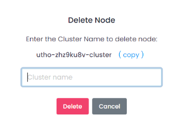

## Manage MariaDB Node

The **Manage MariaDB Node** section enables users to add and delete replica nodes and read-only nodes. This section provides the following functionalities:

### Adding and Deleting Replica Nodes

* **Add Replica Node:** Click the **Add Replica Node** button to open a confirmation box.
  
  

* **Delete:** Click the **Delete** icon.

  

  A confirmation dialog will appear. Confirm the action to proceed with the deletion of the replica node. Upon confirmation, the replica node will be removed.

### Adding and Deleting Read-Only Nodes

* **Add Read-Only Node:** Click the **Add Read-Only Node** button to open a drawer where you can select the data center location and enter the name of the read-only replica node.

  

* **Create Read-Only Node:** Click the **Create Read-Only Node** button to create the read-only node.

* **Delete:** Click the **Delete** icon.

  

  A confirmation dialog will appear. Confirm the action to proceed with the deletion of the read-only node. Upon confirmation, the read-only node will be removed.
