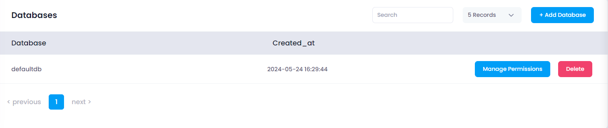

## Manage MySql Databases

The **Manage MySql Databases** section allows users to add databases, manage permissions, and delete databases. This section provides the following functionalities:

### Adding a Database

* **Add Database:** Click the **Add Database** button to open a drawer where you can enter the database name.

  

* **Create Database:** Click the **Create Database** button to create the new database.

### Managing Permissions

* **Manage Permissions:** Click the **Manage Permissions** button to open a drawer where you can select a database user and assign permissions.

  

* **Add Permission:** Click the **Add Permission** button to update permissions for the selected database user.

### Deleting a Database

* **Delete Database:** Click the **Delete** button to remove a database.

  

  A confirmation dialog will appear. Confirm the action to proceed with the deletion. Upon confirmation, the database will be removed.
