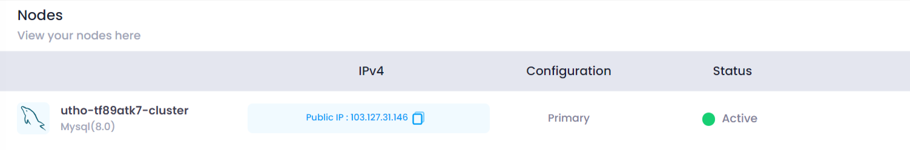

## Manage MySql Node

### Copying IP Address

In the **Manage MySql Node** section, there is an option to copy the IP address of each node. This can be useful for configuration and troubleshooting purposes.

* **Copy IP Address:** Click on this icon to copy the node's IP address to your clipboard.

  
