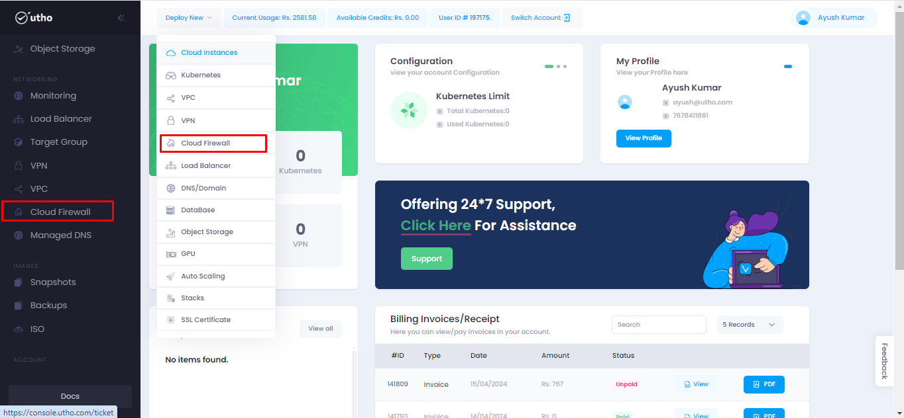
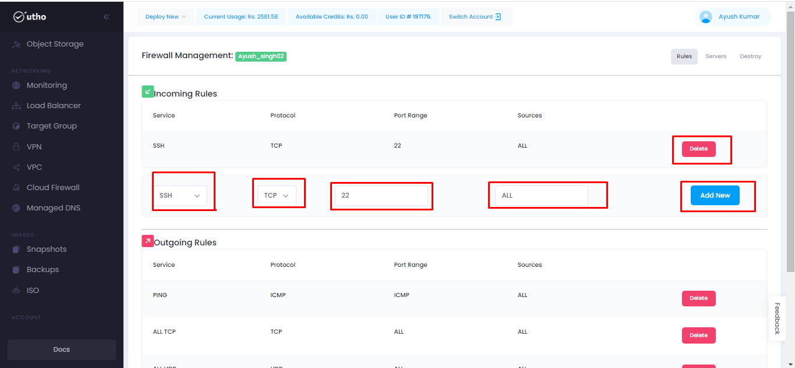
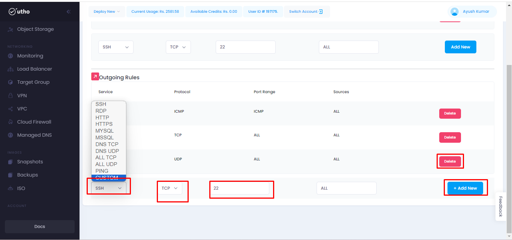
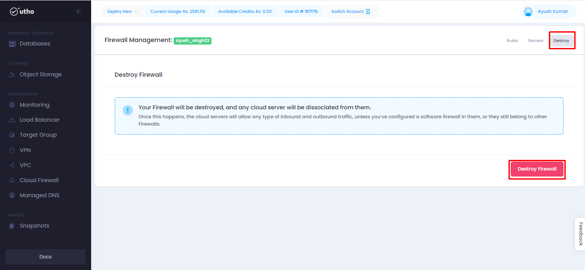

# Firewall
--- 
Firewalls in the cloud function similarly to traditional network firewalls but are specifically designed to secure cloud-based infrastructure and applications. Cloud firewalls provide essential security controls to protect virtual networks, resources, and data within cloud environments. 
Cloud firewalls are essential components of cloud security architectures, helping organizations enforce security policies, control access to resources, and protect against a wide range of threats. They play a critical role in ensuring the security and compliance of cloud-based infrastructure and applications.

### Firewall offer several benefits:
- Managed Firewall Services
- Web Application Firewalls (WAF)
- Network Security Groups (NSGs)
- Security Groups

### Steps for approaching the Firewall:
---
#### Visit on the link given below:
>
[Console url](https://console.utho.com/)
1. This link will redirect you to the Dashboard after Login of the platform. 

 

2.  Here we will get 2 options to reach the Firewall tab.
- Deploy new (Dropdown)
- L.H.S tab

 

3. After clicking it will redirect  you to the Firewall homepage.

 

4. Here user will get two options for creating the cloud firewall as shown in the snippet below.

5. After clicking on this it will redirect user to the page where user can select/input the requirements for his firewall. 
In this page user will provide the name for his firewall and click on the Deploy firewall button.

6. After deploying it will redirect user to the firewall management page where all deployed firewalls will be available as shown in the snippet below.

7. Now on clicking on the manage button it will redirect user to the next page.

8. On next page under Rules section user can create firewall for both Incoming rules and Outgoing rules.

9. Adding firewall for Incoming.
Here user have to fill the various details such as:
- Services
- Protocol
- Port Range
- Sources
After selecting all the details user should click on Add New.
Then a new custom rule will be applied to the firewall.
Also on clicking on the delete button user can delete the applied rule.

10. Adding firewall for Outgoing.
Here user have to fill the various details such as:
- Services
- Protocol
- Port Range
- Sources
After selecting all the details user should click on Add New.
Then a new custom rule will be applied to the firewall.
Also on clicking on the delete button user can delete the applied rule.

11. Now moving to servers tab, In this clicking on the dropdown of add server and select the required server.
Click on add server to attach that server to the firewall.

12. After the firewall is attached with the cloud an option will occur to view cloud on clicking on that it will redirect the user to the cloud instance page where the firewall is attached.
Also if the firewall is not attached wit any cloud then it will show option  for creating the new cloud instances.
Also if the server is not required then on clicking on delete button user can  delete the server.

Now moving to the Destroy tab, Here if there is no need of the firewall then on clicking on destroy button user can delete that firewall.
Once deleted it can not be recovered.

After deleting the firewall it wil redirect user to the firewall homepage.

---
**THE END**

